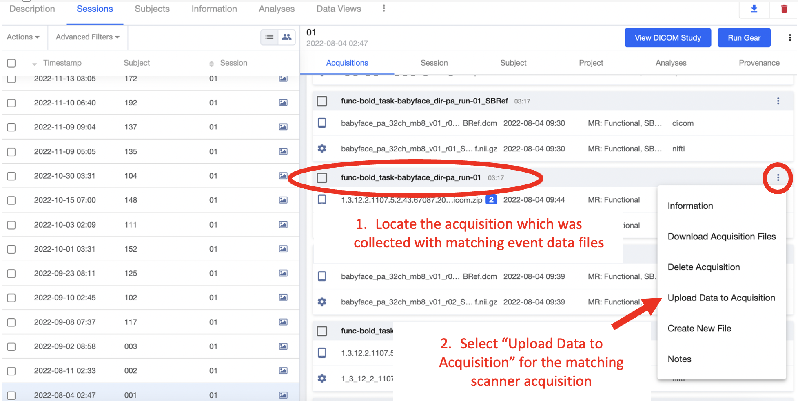
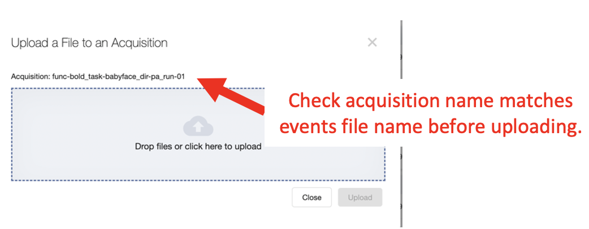

.. _common_gears:

Running Commonly Used Gears
===============================
IF you have not already reviewed the ":ref:`Gears`" Basics, please go back and work through the introduction to Gears before continuing. In the following documentation, step-by-step instructions to run commonly used gears are included. If you have any questions, please contact INC staff. To contribute, please use the INC github `repository <https://github.com/intermountainneuroimaging>`_

For all gears described below, begin by launching a session level analysis gear.

1.	Select the session for the new analysis from the list of sessions on the left hand side. Once the correct session is selected, click “Run Gear” in the top right corner.

    .. image:: imgs/common_gears/run_common_gears_1.png
       :alt: Session panel

2.  From the popup window, select “Analysis Gear”

    .. image:: imgs/common_gears/run_common_gears_2.png
       :alt: analysis prompt

MY BRAIN SOUVENIR
*****************************
`My Brain Souvenir <https://github.com/intermountainneuroimaging/my-brain-souvenir>`_ is a custom Flywheel Gear used to generate electronic souvenirs for study participants. Image formats (GIF | JPEG | MOV) can be specified and output images can be configured to store defaced, brain extracted, or native images. Each study should check with the IRB coordinator to confirm appropriate sharable image formats and venues (e.g. email, secure link, etc).

1. From the drop down list of available gears, select “Brain Souvenir”

    .. image:: imgs/common_gears/run_brain_souvenir_1.png
       :alt: analysis prompt

2. This gear requires no inputs, and the default configuration is pretty good. I recommend changing the image size config setting (image size = 0.8), to ensure the output images are small enough to be sent as email attachments. From the “Run Analysis Gear” Menu, select the Configuration panel.

    .. image:: imgs/common_gears/run_brain_souvenir_2.png
       :alt: analysis prompt

+------------------------+-----------------------------------------------+
| Filename               | Conte                                         |
+========================+===============================================+
| <anat-acq>.gif         | Native Anatomical Scan (GIF Format)           |
+------------------------+-----------------------------------------------+
| <anat-acq>.jpg         | Native, single midplane slice (JPEG Format)   |
+------------------------+-----------------------------------------------+
| <anat-acq>.mov         | Native Anatomical Scan (MOV Format)           |
+------------------------+-----------------------------------------------+
| <anat-acq>_defaced.gif | Defaced Anatomical Scan (GIF Format)          |
+------------------------+-----------------------------------------------+
| <anat-acq>_defaced.jpg | Defaced, single midplane slice (JPEG Format)  |
+------------------------+-----------------------------------------------+
| <anat-acq>_defaced.mov | Defaced Anatomical Scan (MOV Format)          |
+------------------------+-----------------------------------------------+

BIDS CURATE
*****************************
BIDS Curate gear should be run for all neuroimaging MRI sessions. Before running (or re-running) bids curate, all acquisitions should be in reproin standard naming format. If you are unsure if your data can be BIDS curated, contact INC staff.

1.	From the popup window, select “Analysis Gear” and scroll through the available gears to “BIDS Curation”

    .. image:: imgs/common_gears/run_bids_curate_1.png
       :alt: analysis prompt

2.	Add the appropriate inputs and configurations for the gear as shown below.

    .. image:: imgs/common_gears/run_bids_curate_2.png
       :alt: analysis prompt

In the configuration tab, you may need to add following options:

    (if re-running bids-curate) Reset : :code:`True`

    (if diffusion tensor in study) intendedfor_regex : :code:`.*fmap.* nii`

    .. image:: imgs/common_gears/run_bids_curate_3.png
       :alt: analysis prompt

3.	That’s it! Select the “Run Gear” button. Once the gear starts you should see the analysis in the list of session analyses. The icon next to the analysis will change from a spinning gear to a green check once it completes successfully. Check out the outputs of the gear to confirm BIDS naming convention was correctly applied.

EVENT CURATOR
*****************
The event curator is a derivative analysis using the `hierarchy curator <https://github.com/intermountainneuroimaging/hierarchy-curator>`_. A custom python script should be written to handle event creation from either an eprime or PychoPy simulus file. After uploading the recordings (see ":ref:`Uploading Event Files`"), this gear is used to generate derivative event data from the stimulus recordings. For help generating a python script for use with the hierarchy curator, contact INC staff.

1.	After uploading the raw timing files for all applicable acquisitions, you can generate event data using the “Hierarchy Curator” gear. You must have supporting curator code uploaded to your project. If you do not have an “events_curator.py” file in your project contact the INC Data and Analysis Team for assistance!

    .. image:: imgs/common_gears/run_events_curator_1.png
       :alt: analysis prompt

2.	Return to the session of interest and select “Run Gear”. From the drop down menu, select “Hierarchy Curator”

    .. image:: imgs/common_gears/run_events_curator_2.png
       :alt: analysis prompt

3.	In the Gear “Inputs” select the “events_curator.py” file as the curator.

    .. image:: imgs/common_gears/run_events_curator_3.png
       :alt: analysis prompt

4.	That’s it! After the gear finishes, check that new event files have appeared in the sessions acquisitions named “…events.tsv”

BIDS-MRIQC
*****************************
`bids-mriqc <https://github.com/intermountainneuroimaging/my-brain-souvenir>`_ is a Flywheel wrapper for mriqc. MRIQC is used to extract image quality metrics (IQMs) from structural and functional magnetic resonance imaging data. Please cite the use of MRIQC as follows:

Esteban O, Birman D, Schaer M, Koyejo OO, Poldrack RA, Gorgolewski KJ; MRIQC: Advancing the Automatic Prediction of Image Quality in MRI from Unseen Sites; PLOS ONE 12(9):e0184661; doi:10.1371/journal.pone.0184661.

MRIQC is automatically run for all new sessions on INC Flywheel. If you need to change configuration settings, or re-run a failed job follow the instructions below.

1. From the drop down list of available gears, select “BIDS MRIQC”

    .. image:: imgs/common_gears/run_bids_mriqc_1.png
       :alt: analysis prompt

2.	IMPORTANT!! This gear is HPC Compatible. Please always launch this gear on hpc to keep other compute resources free. To run the job on our HPC clusters, add a “Job Tag”: hpc

    .. image:: imgs/common_gears/run_bids_mriqc_2.png
       :alt: analysis prompt

3.	If your project has a .bidsignore file stored in the project information, add this file as the optional gear input.

4.	Next, move to the Configuration panel. You will see configuration options for mriqc performance as well as CU Boulder’s HPC slurm scheduler. In general, these configuration settings can be set to default values. You can always find out more information about each configuration setting by hovering the mouse over the information circle next to each setting.

    .. image:: imgs/common_gears/run_bids_mriqc_3.png
       :alt: analysis prompt

6.	Set the HPC slurm scheduler settings as needed. By default the gear will run on blanca-ics with appropriate memory, RAM and wall time.

7.	That’s it! Select the “Run Gear” button. Once the gear starts you should see the analysis in the list of session analyses. The icon next to the analysis will change from a spinning gear to a green check once it completes successfully.

Uploading Event Files
===========================

A critical step to ensure all relevant fMRI data is stored and accessible within Flywheel requires users to upload the Stimulus data. Users may upload the data from the user interface or from the command line. Please review both options below. **Important** Timing files should be named exactly as shown in the instructions here to enable easy scripting within Flywheel.

1. USER INTERFACE
************************
UPLOAD RAW EVENT TIMING DATA (PYSCHOPY or EPRIME)

1.	From the stimulus computer, use the experimentation software (e.g. pyschopy or eprime) to export event data in a spreadsheet format (e.g. *.csv, *.tsv).

2.	You will need to upload the event file to Flywheel, to do so: navigate to your project, and go the sessions panel. Select the session of interest.

3.	In the acquisition view, find the correct acquisition to match the event data. For example, an acquisition “func-bold_task-babyface_dir-pa_run-01”

4.	BEFORE uploading the event data, the file should be renamed to the correct naming convention. All event data must follow this STRICT BIDS naming convention: <acquisition>_recording-[pyschopy/eprime]_stim.tsv

    :code:`file_from_stim_computer.tsv -> func-bold_task-[task]_dir-[dir]_run-[index]_recording-eprime_stim.tsv`

5.	After renaming the raw data file, upload the file to the Flywheel acquisition of interest.

6.	Locate the file for upload. BE SURE the file is named using the correct filename convention (STEP 4). Select “Upload”.

7.	Repeat this process for all acquisitions with task related events files.

2. COMMAND LINE INTERFACE
***************************
UPLOAD RAW EVENT TIMING DATA (PYSCHOPY or EPRIME)

If you are looking to upload many stimulus files together, or are intersted in scripting the upload for a crontab (automatically run for new sessions). Consider using the command line interface to upload stimulus files.

Before using the Flywheel CLI, first organize your stimulus files into the structured hierarchy enforced by Flywheel.
::
    PROJECT
    |-- SUBJECT
        |-- SESSION
            |-- ACQ LABEL 1
                |-- Stim file
            |-- ACQ LABEL 2
                |-- Stim file
            |-- ACQ LABEL 3
                |-- Stim file

For example the file tree could look like...
::
    my-directory
    |-- my-project
        |-- 001
            |-- S1
                |-- func-bold_task-motor_dir-ap_run-01
                    |-- func-bold_task-motor_dir-ap_run-01_recording-pyschopy_stim.tsv
                |-- func-bold_task-motor_dir-ap_run-02
                    |-- func-bold_task-motor_dir-ap_run-02_recording-pyschopy_stim.tsv
                |-- func-bold_task-nback_dir-ap_run-01
                    |-- func-bold_task-nback_dir-ap_run-01_recording-eprime_stim.tsv
        |-- 002
            |-- S1
                |-- func-bold_task-motor_dir-ap_run-01
                    |-- func-bold_task-motor_dir-ap_run-01_recording-pyschopy_stim.tsv
                |-- func-bold_task-motor_dir-ap_run-02
                    |-- func-bold_task-motor_dir-ap_run-02_recording-pyschopy_stim.tsv
                |-- func-bold_task-nback_dir-ap_run-01
                    |-- func-bold_task-nback_dir-ap_run-01_recording-eprime_stim.tsv

Notice in the above example, stimulus files are labeled using reproin naming convention to match naming of the fMRI acquisition. The stimulus file must include the suffix :code:`_recording-[pyschopy,eprime,other]` to indicate its a raw recording file. Multiple session files can be stored and should conform to the Flywheel hierarchy (project -> subject -> session -> acquisition). If events are non-unqiue across all participants, the stimulus files can be uploaded at a project level.

Once files are properly named and organized in the Flywheel hierarchy, use the following CLI command to upload to flywheel. **Important** Be sure to include the :code:`--skip-existing` argument to avoid overwriting previously uploaded data.
::
    fw ingest folder -g [group-id] -p [project-label] --skip-existing --symlinks --yes [path-to-source-data]

For the above example...
::
    fw ingest folder -g ics -p my-project --skip-existing --symlinks --yes /home/ics/my-directory/my-project/

Please consult INC Staff for assistance importing event files or other datatypes.

.. sectionauthor:: Amy Hegarty <amy.hegarty@colorado.edu>