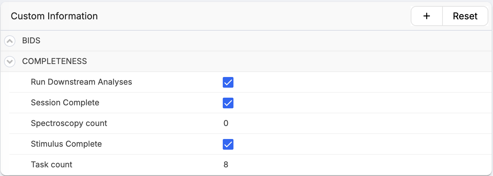
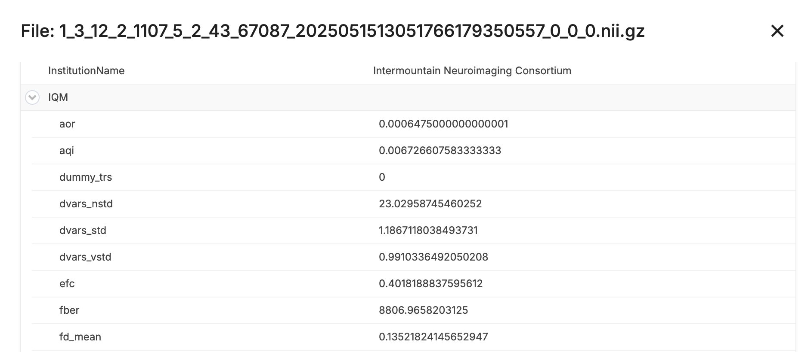
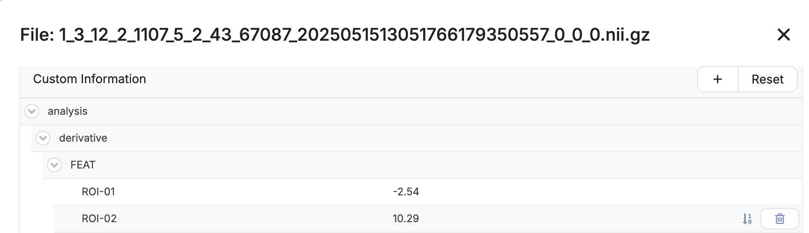
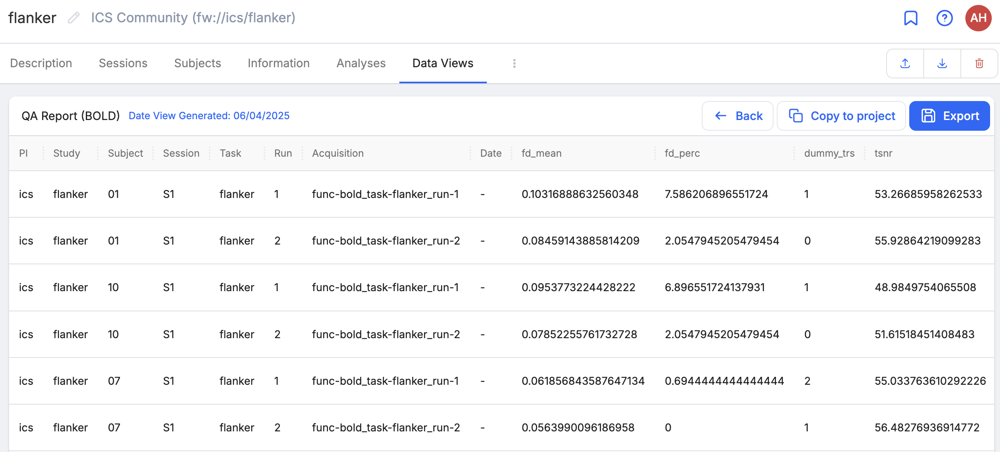

.. _data_and_metadata:

Metadata & Dataviews
=========================

Metadata is simply information about your data or "data about data". Metadata does not include the contents of your data such as the image itself. Instead, metadata is generally descriptive information about the data such as when the file was created or modified, the file owner, etc. Metadata is stored at each level of the Flywheel hierarchy, with descriptive information about the :code:`Project`, :code:`Subject`, :code:`Session`, :code:`Acquisition`, :code:`Analysis`, or :code:`File`.

For example, each subject has rich metadata associated with that "container".

.. image:: imgs/viewing_data/subject_metadata_1.png
   :alt: subject metadata

Acquisition and file metadata can be viewed in Flywheel by first expanding the menu options, and selecting Information.

.. image:: imgs/viewing_data/acquisition_metadata_1.png
   :alt: acquisition metadata

Adding Custom Metadata
------------------------
It is also possible to add your own metadata within the “Custom Information” section. Users may add different “types” of metadata such as strings, lists, boolean values, numbers, and complex objects containing additional metadata. For more information about adding your own metadata visit the flywheel documentation (`here <https://docs.flywheel.io/hc/en-us/articles/360015412973-Add-and-edit-custom-metadata#:~:text=Subject%20and%20session%20custom%20metadata,click%20%2B%20next%20to%20Custom%20Information.>`_).

.. image:: imgs/viewing_data/custom_metadata_1.png
   :alt: custom metadata

"Quality Assurance" Metadata
------------------------------
For most neuroimaging studies conducted at INC, a set of quality assurance related metadata will be generated for each data collection session.

Completeness Metadata
++++++++++++++++++++++
Using the flexible "hierarchy curator" flywheel gear, INC staff will help users generate a "completeness" curator script that will be run following each data collection session. :code:`Session` level metadata will be stored describing the session's data collection and flagging deviations from the study protocol. As described in more detail in the :ref: `Auto workflow` section, the "Completeness" metadata can be used to dictate downstream analyses to be run for each session. "Completeness" metadata can be used to quickly identify any missing, incomplete, or duplicate acquisitions, which require human intervention to interpret and resolve.

Image Quality Metrics (IQMs) Metadata
+++++++++++++++++++++++++++++++++++++++
For studies where the "BIDS MRIQC: Automatic prediction of quality and visual reporting of MRI scans in BIDS format" Gear are included in the analysis workflow, additional *Image Quality Metrics (IQMs)* metadata will be stored in Flywheel. IQM metadata are attached to the raw nifti files for each associated acquisition making it easy to extract the metadata using Flywheel.io's Dataview tool (see below).

"Analysis Derivatives" Metadata
----------------------------------
"Analysis Derivative" metadata can be generated by Flywheel Analysis Gears. This flexible metadata is attached to the raw nifti files (similar to that of the IQM special case described above). "Analysis Derivative" data may include any metadata associated with custom flywheel analysis such as region of interest metrics, model fit summary statistics, and more. All file level metadata (as described here) can easily be extracted for group analyses using the Dataview tool.

Dataviews
-----------
"Dataviews" is a tool within flywheel to report metadata across projects or collections. Specifically, users can select metadata objects of interest and curate all instances across a given project. We strongly recommend starting by reviewing the "Shared Dataviews" on the platform, to see what types of reports have been generated by other users and studies.

To learn more about creating and editing Dataviews, check out Flywheel.io documentation `here <https://docs.flywheel.io/user/reporting/data-views/user_data_views/>`_.