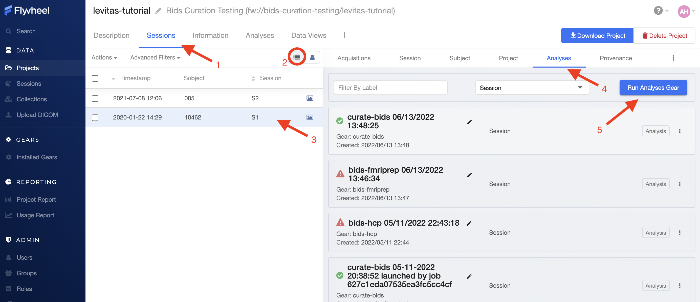

.. _gears_in_UI:

Gears
========

Overview
********************
In Flywheel, a "Gear" is another name for an analysis or computations run on your data.
Flywheel Gears are “containers” that package or “bundle” important metadata with the analysis results. Additional information stored within gears includes all of the information about who ran the analysis, when, with what inputs, the analysis software name, version, maintainer, and of course all of the analysis outputs. Gears keep this critical metadata in one place making analyses trackable and easier to review. Gears will already be installed into Flywheel by INC staff, if you wish to add more, see :ref:`Looking For Other Gears?`. You can view all gears installed on the UCB Flywheel Instance in the "Installed Gears" View in the Gears section of the sidebar menu. Interested in learning more about gears? Check out Flywheel's documentation on gears `here <https://docs.flywheel.io/hc/en-us/articles/360008411014-Using-gears>`.

Running Gears
********************
It is important to note, you can start a gear from multiple levels of the Flywheel hierarchy. This provides the flexibility to run a range of software tools that may need any number of inputs, such as only a single acquisition (:code:`acquisition level`), all acquisitions in a session (:code:`session level`), all sessions for a single subject (:code:`subject level`), multiple or all subjects in a given project (:code:`project level`). Being diligent about the Flywheel hierarchy level you use to run your gear is critical. For example, some gears will only execute if run at a “session” level.

Running Gears at the Project Level
++++++++++++++++++++++++++++++++++++
Running gears at a project level is most commonly used for running group analyses. In order to run a gear on an entire project, follow the steps below.

1. Select "Projects" on the sidebar menu.
2. Select your active project.
3. Navigate to the "Analyses" panel in that project.
4. Click the “Run Analysis Gear” button in the upper right corner.

5. Select the gear and version
6. Click “Run Gear”

Running Gears at the Subject Level
++++++++++++++++++++++++++++++++++++
Running gears at a subject level is most commonly used for analyses that require multiple or all sessions from a single subject to be accepted as inputs at the same time. Many BIDS formatted analyses may be run at a subject or session level. In order to run a gear on an entire subject, follow the steps below.

1. From your project, select "Sessions" panel
2. Toggle the View to "Subject View"
3. Select a single subject for your analysis
4. Select the "Analyses" panel inside the Sessions Menu
5. Click the “Run Analysis Gear” button in the upper right corner

Running Gears at the Session Level
++++++++++++++++++++++++++++++++++++
Running gears at a session level is the most common method for running analysis gears. Most Gears including curation, re-naming, and preprocessing gears can be run on a single session. In order to run a gear on a single session, follow the steps below.

1. From your project, select "Sessions" panel
2. Make sure the view is toggled to "List View"
3. Select a single session for your analysis
4. Select the "Analyses" panel inside the Sessions Menu
5. Click the “Run Analysis Gear” button in the upper right corner

Running Gears at the Acquisition Level
+++++++++++++++++++++++++++++++++++++++++
Running gears on a single acquisition is generally reserved for light weight "Utility" Gears and "Gear Rules", which will be discussed later. In order to run a gear on a single acquisition, follow the steps below.

1. From your project, select "Sessions" panel
2. Make sure the view is toggled to "List View"
3. Select a single session for your analysis
4. Select the "Acquisitions" tab
5. Click the “Run Gear” button in the upper right corner
6. Select either "Utility Gear" or "Analysis Gear" (gear methods discussed below)
    - Important! Running an "Analysis Gear" will default to running at a :code:`Session Level` even from this menu!

Gear Versions
++++++++++++++++
Flywheel Gears are version controlled, meaning both the underlying software version and the version of Flywheel's container are recorded and stored in the analysis. In addition, INC often makes custom changes to the gears on this instance and is identified with INC versioning.

.. code-block::
   :caption: Flywheel Gear Versions

   1.2.5_20.0.6_inc1.0
   1.2.5  --> Flywheel Gear Version
   20.0.6 --> Underlying Pipeline / Software Version
   inc1.0 --> INC Customized Version

.. note::
   When starting a new analysis, it is best practice to select the most updated version of the gear. Once a version is selected for a project, we recommend to use the same version for the duration of your project.

Gear Methods
****************

Running Utility Gears
++++++++++++++++++++++
Utility Gears are lightweight analyses usually used only for converting file types or performing quality assurance checks. The outputs of these gears are saved directly with the input data.

1. Navigate to the desired project
2. Select the "Sessions" panel
3. Select the desired session from the list of sessions
4. From the "Acquisitions" tab, Click “Run Gear” in the upper right corner
5. Select Utility Gear

6. Select a Gear and version of the Gear to run
7. Choose a file for the input
8. Under the configuration tab, select the necessary options for your job
    a. For more information about each configuration setting, hover the mouse over the info icon next to the configuration
    b. The information tab tells you all the data and metadata that will be stored about the job
9. Click “Run Gear”

Running Analysis Gears
+++++++++++++++++++++++
Analysis Gears used for larger analyses and are organized as unique containers (or "folders") in flywheel. Analysis Gears package additional information include the gear inputs, configuration, version, logs, and outputs.

1. Navigate to the desired project
2. Select the "Sessions" tab
3. Select the desired session from Session's List
4. From the "Acquisitions" panel, Click “Run Gear” in the upper right corner
5. Select Analysis Gear
6. Select the gear and version of the gear you want to run
7. Select all the necessary input files
8. Change any options under the configuration tab that are needed
    a. For more information about each configuration setting, hover the mouse over the info icon next to the configuration
    b. The information tab tells you all the data and metadata that will be stored about the job
9. Select “Run Gear”

Running High Performance Compute (HPC) Analysis Gears
+++++++++++++++++++++++++++++++++++++++++++++++++++++++++
In order to run Gears on the HPC environment, add a job tag “hpc” when setting up the analysis. This job tag is case sensitive. Additional settings including SLURM resources configurations may be available in the gear's configuration settings.

View Gear Status
*****************

To view the progress of your gear, navigate to the desired session, and then select the "Provenance" tab. Provenance shows a list of all gears for a specific session. To view the results of your *Analysis* Gears, navigate to the "Analyses" tab.

What To Do If Your Gear Failed?
++++++++++++++++++++++++++++++++
If your Gear fails, first check the job log. If there is an obvious error message such as missing or incorrect input, make that change and run the gear again. If a problem persists or you cannot determine why the gear failed, reach out to the INC staff for assistance.

What To Do If Your Gear Succeeded?
+++++++++++++++++++++++++++++++++++
After your analysis gear completes successfully you can inspect the results  in the "Analyses" tab. Select the analysis container of interest. You should see a "Results" tab with all data created during the analysis. From this container, you may also review the records of all inputs, configurations, gear information, and logs.

.. image:: imgs/gears_in_UI/gear_status_1.png
   :alt: Reviewing the status of your job.

Looking For Other Gears?
**************************
The `Flywheel Gear Exchange <https://flywheel.io/gear-exchange/>` is a place where you can see other gears created for Flywheel. If you wish to add another gear to our Flywheel instance, look on the Gear Exchange and contact a member of the INC staff to request the gear be added to UCB Flywheel instance.

