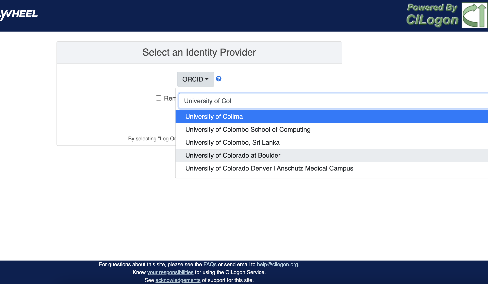

# Getting Started With UCB Flywheel

## Overview
Flywheel.io is an imaging platform that provides a range of services for researchers in the life sciences. Flywheel provides a platform to streamline data aggregation, curation, and management and supports clinical and academic research performance and collaboration. The intermountain neuroimaging consortium (INC) at CU Boulder has leveraged the power of Flywheel.io and the considerable resources available through University of Colorado Research Computing to provide a seamless experience for all researchers from data collection at our MRI facilities to data analysis, visualization, and publication.

## How To Cite Us
…(CURC citations), AWS citations, flywheel… commercial citations  

## Logging Into Flywheel

**UNIVERSITY OF COLORADO AT BOULDER USER**  
To logon as a UCB user, you need only a University of Colorado Identikey, not sure if you have one? Contact us… 
1. From your web browser, go to Flywheel (flywheel.rc.colorado.edu)
2. Select University Credentials via CILogon

3. If this is your first time logging on, you will be redirected to the CILogon portal to select your organization. 
    - Find University of Colorado Boulder
    - Check “Remember this Selection
    - Click “Log on”

4. You will be directed to the CU Boulder logon page. Enter your Identikey and Password
5. You are now on the CU Boulder Flywheel Instance!

**External Users**  
Do you have an account with a University, ORCID, or another organization apart of CILogon system? If you are not sure, you can check here https://cilogon.org/.
**If you have a CILogon account, contact your collaborator at University of Colorado Boulder with those credentials. Once you are added to our flywheel instance, you can follow the instructions above. Selecting your CILogon system instead of CU Boulder**  

If you do not have a CILogon account, contact your collaborator and ask for a University of Colorado Boulder Affiliate Account. These accounts will provide you access to the UCB systems for a period of one year.

## Navigating The User Interface
Flywheel.io is an imaging platform used to receive, curate, manage, and analyze data from MRI facilities. Intermountain neuroimaging consortium (INC) is excited to host an “on premise” instance of flywheel for clinical and academic researchers within the region. The “on premise” instance means all data storage as well as computation is completed using University of Colorado services. For those familiar with other “PACS” systems, flywheel provides a service to receive and view data directly from our MRI scanner, but additionally provides opportunity to view, interact, analyze, and publish your data from the flywheel platform.
 Most importantly, flywheel is a FAIR compliant platform. F-A-I-R is a data principle adopted by both the National Science Foundation (NSF) and National Institute of Health (NIH, beginning 2023) to prompt transparency and reproducibility. **F**indability, **A**ccessibility, **I**nteroperability, and **R**euse cornerstone this principle.  Flywheel supports the FAIR data practice mission by ensuring rich metadata for all data stored within the platform, in addition to detailed provenance meaning who made or changed the data in what way. By conforming to best data practices, INC hopes to elevate the importance of transparent and reproducible research in the neuroimaging community.
  Haven't gotten started with flywheel yet? Check out documentation about logging in to get started <docs link>. 

**What is a hierarchy?**  
A hierarchy is simply the system we rank or organize data according to a parent-child relationship. You might think of this as a folder on your computer that contains other folders and files. In this case the ‘parent’ folder has other ‘child’ subfolders and files. 

Flywheel uses a hierarchical data model to store data. In this way, data is automatically stored in an ordered way by principal investigator, study, subject, session, and acquisition. 

**Object Based Storage Principles.**  
We are not going to get into the weeds here… What is important is that Flywheel uses object based storage to store all raw and derived neuroimaging data. Generally, object based storage is more efficient and attaches a lot more information about how the data was created, modified, or used within the data structure itself. What does this mean for you? Neuroimaging storage on flywheel takes up less disk space (its cheaper!) and contains a lot more information to search or retrieve data later on. Interested in learning more? <https://www.ibm.com/cloud/blog/object-vs-file-vs-block-storage>

**What are Containers in Flywheel?**  
Containers are the data storage building blocks within Flywheel. Why does this matter? If you are thinking about retrieving data, running analyses, or even reviewing data already stored, you need to think about how to retrieve this data from a container. In layman's terms, a container could be thought of as a “folder” on your computer which can contain other “folders” or containers, as well as files or metadata, meaning information about that folder, such as when it was created or modified, its name, etc.

In flywheel containers are used to store “groups”, “projects”, “subjects”, “sessions”, “acquisitions”, and “analyses”. We get into the meaning of each of these containers below, but you can think of these containers as folders of flywheel that bundle metadata and data together.

<image of flywheel architecture>

**Accessing my Groups**  
At INC, we use “Groups” to assign a principal investigator or laboratory. Here “Groups” can store multiple different projects or “studies”, have specific users and user permissions, and have administrative roles to add / edit / delete data and metadata for everything container within. In Flywheel, you can identify Groups by the “tag” associated with any of your projects. As a Admin, you can also make changes to user permissions and projects within your “group”. For more information on this topic, please refer to our tutorial on “User Permissions” <link>.

<image here>

**Accessing my Projects**  

At INC, “Projects” are used to differentiate studies conducted within a Principal Investigator’s laboratory. Users can access all projects they have permissions to view from the left hand ribbon on the projects page:

It is also easy to identify which group each project belongs to from this page. In the second column of the project list you will find the parent group. From the Project's landing page, you can select any group to view the project in more detail. “Projects” have several attributes including a description, project files, subjects, sessions, custom data views and more! Check out our upcoming tutorial to learn more about how to customize your project to meet your needs.

Accessing Subjects or Sessions 
If this is a new project, you may not see any subjects or session linked to your project. If you have already started scanning, or have uploaded historical data from your project you should see the data contained as “sessions.” 

“Subjects” are used to bundle sessions together collected on the same participant across multiple days or “sessions”. We identify subjects using a single Subject ID. This ID should be unique to the participant in the current study. If this ID needs to be “coded” with a reference to any personal identifiable information (PII), that info MUST be stored outside flywheel in a database such as COINS or REDCap. If you have questions about storing participant information, please contact INC!

From a project within Flywheel, the easiest way to access subjects and sessions is from the “Sessions” panel shown here:

Within the sessions panel, you may notice the sessions are sorted by date of collection, and show a summary of the Subject ID and Session ID for that set of acquisitions. To view the same data in “Subject view” you need to select the Subjects’ icon shown here:

**Accessing Acquisitions and Files**  
Finally, acquisitions are flywheel containers within a session, and hold any files and metadata associated with a scanner sequence. For example, an acquisition may contain a set of dicoms, the nifti converted file for the same image, and task or behavioral data for the same task. As you may recall from earlier, these “containers” in layman's terms are just like folders or directories that hold relevant files. In flywheel, we can see acquisitions and files within the project view, as shown below:

That’s it folks! Tune in for more information and tutorial regarding Flywheel at UCB!
