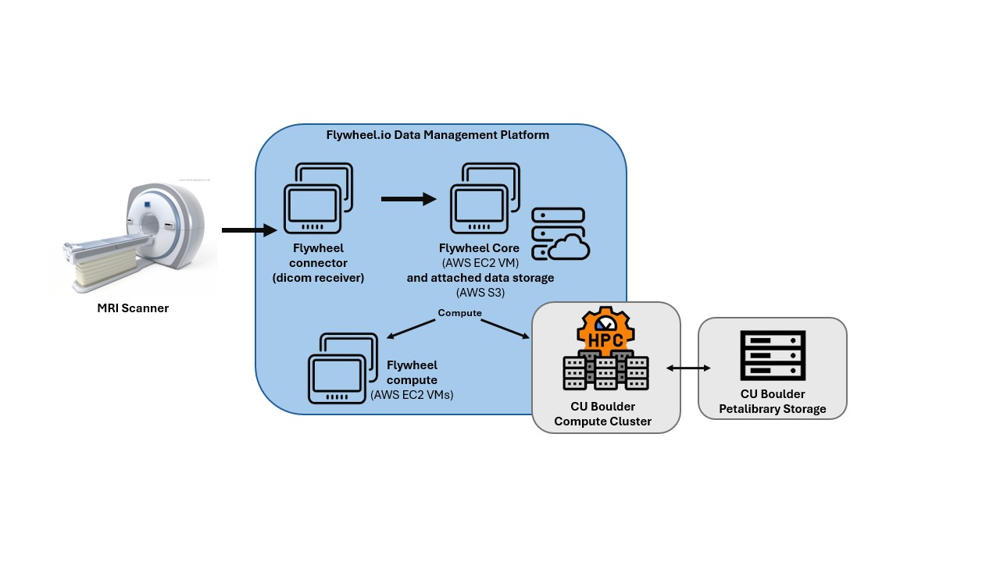

.. _getting_started:

Overview
========
Flywheel.io is an imaging platform used to receive, curate, manage, and analyze data from scientific facilities. Intermountain Neuroimaging Consortium (INC) is excited to host a “cloud” deployment of Flywheel.io for clinical, industry, and academic researchers within the region. Deidentified research imaging data may be stored in the Flywheel.io data management system which is deployed on AWS cloud services and AWS's S3 data storage. INC at CU Boulder has leveraged the power of Flywheel.io and the considerable resources available through University of Colorado Research Computing to provide a seamless experience for all researchers from data collection at our MRI facilities to data visualization, data analysis on CURC's high performance compute clusters, and data publication.

For those familiar with other “PACS” systems, Flywheel also provides a service to receive and view data directly from the Intermountain Neuroimaging Consortium's 3T Prisma Fit MR scanner.

Most importantly, Flywheel is a FAIR compliant platform. **F-A-I-R** are a set of data principles adopted by both the National Science Foundation (NSF) and National Institute of Health (NIH, beginning 2023) to prompt transparency and reproducibility. **F**\indability, **A**\ccessibility, **I**\nteroperability, and **R**\euse cornerstone these principles. Flywheel supports the FAIR data practice mission by ensuring rich metadata for all data stored within the platform. Flywheel also enforces the use of provenance, meaning the storage of information about "who, what, when, how" in data creation and management. By conforming to these best data practices, INC hopes to elevate the importance of transparent and reproducible research in the neuroimaging community.

Computing Architecture at CU Boulder
**************************************

Interested in learning more? Check out our introductory video `here <https://o365coloradoedu.sharepoint.com/:v:/s/INC-microsoft-teams/EcA4VTfuZzdAiCAvN19Y1qkBazUkLHGT9A-LddKcIKgoUQ?e=qGclwA>`_.

Also, check out Introduction to Flywheel Webinar `here <https://docs.flywheel.io/hc/en-us/articles/4536038984595-Webinar-series-Intro-to-Flywheel>`_.

Value Added
****************
Research and medical imaging data are notoriously difficult to manage: large file sizes, inconsistent naming across sites and scanners, sensitive PHI/PII that must be protected, and a growing list of funder requirements around sharing and reproducibility. Flywheel directly addresses these challenges, and offers real advantages over lab-managed file shares or ad hoc storage.

Organize
----------
Flywheel enforces a consistent :ref:`Hierarchy` (:code:`Group` > :code:`Project` > :code:`Subject` > :code:`Session` > :code:`Acquisition`) for every study, so data collected months or years apart, or by different lab members, always lands in a predictable, searchable structure. Rich, structured metadata is captured automatically at every level and can be extended with study-specific fields, meaning you no longer have to reconstruct "what happened in this session" from a spreadsheet or a lab notebook. For studies using BIDS/reproin naming conventions, this organization extends cleanly into standardized derivatives and analysis pipelines.

Store
----------
All data are stored securely on AWS S3 with automatic backups, eliminating the risk of a single failed hard drive or laptop wiping out a study's data. Every file is version controlled, and every action taken on the data (who, what, when, and how) is captured as :ref:`Provenance`, so analyses stay reproducible and auditable long after they were run. Flywheel also enforces de-identification requirements before data enters the platform (see :ref:`Deidentification`), helping studies stay compliant with PHI/PII handling requirements without relying on manual review.

Share
----------
Fine-grained :ref:`User Permissions` make it easy to collaborate with lab members, cross-institution partners, or outside collaborators, without giving away more access than intended. Collections let you curate and share a subset of sessions across projects (for example, for radiologist review) without duplicating data. Dataviews make it simple to extract and export metadata for statistical analysis or reporting. And because Flywheel is a FAIR-compliant platform, the data you collect is already structured for the data-sharing requirements many NIH and NSF awards require, including submission to national repositories like the NDA (see :ref:`NDA Data Submissions`).

In This Section
*******************
This "Getting Started" area used to be one long page — it's now split into four shorter documents so each topic is easier to find and read:

* This page: an overview of the platform and why it's valuable for organizing, storing, and sharing imaging data.
* :doc:`at_the_scanner` — what has to happen at the scanner console so your data lands in the right place in Flywheel.
* :doc:`navigating_ui` — a tour of the Flywheel web interface, from logging in to running analyses.
* :doc:`citing_inc` — how to cite INC and Flywheel in your publications.