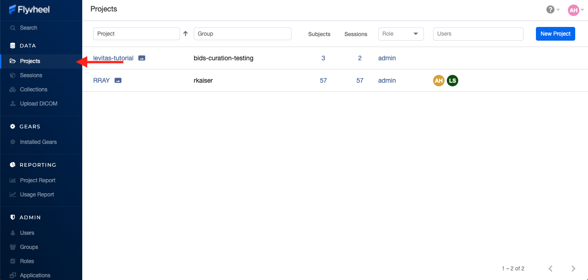
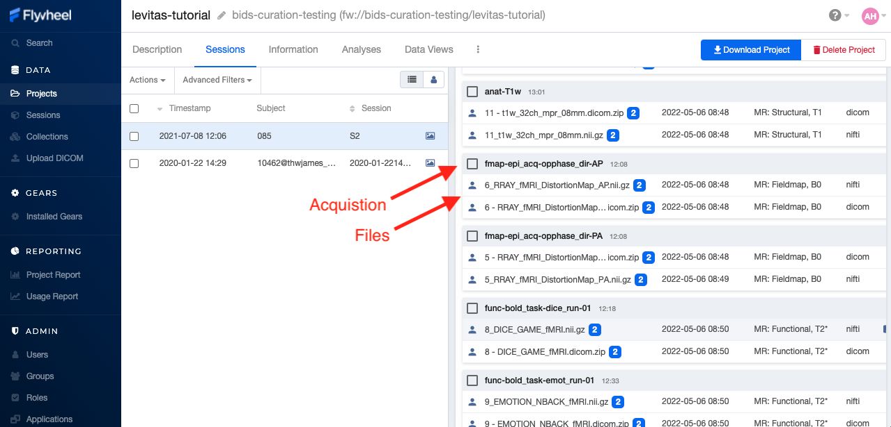

.. _getting_started:

Overview
========
Flywheel.io is an imaging platform used to receive, curate, manage, and analyze data from scientific facilities. Intermountain neuroimaging consortium (INC) is excited to host an “on premise” instance of Flywheel.io for clinical, industry, and academic researchers within the region. The “on premise” instance means all data storage as well as computation is completed using University of Colorado services. INC at CU Boulder has leveraged the power of Flywheel.io and the considerable resources available through University of Colorado Research Computing to provide a seamless experience for all researchers from data collection at our MRI facilities to data analysis, visualization, and publication.  

For those familiar with other “PACS” systems, flywheel also provides a service to receive and view data directly from the Intermountain Neuroimaging Consortium's 3T Prisma Fit MR scanner.  

Most importantly, flywheel is a FAIR compliant platform. **F-A-I-R** is a data principle adopted by both the National Science Foundation (NSF) and National Institute of Health (NIH, beginning 2023) to prompt transparency and reproducibility. **F**\indability, **A**\ccessibility, **I**\nteroperability, and **R**\euse cornerstone this principle. Flywheel supports the FAIR data practice mission by ensuring rich metadata for all data stored within the platform. Flywheel also enforces the use of provenance, meaning the storage of information about "who, what, when, how" in data creation and management. By conforming to these best data practices, INC hopes to elevate the importance of transparent and reproducible research in the neuroimaging community.

Logging Into Flywheel
=====================
Flywheel uses CILogon service to manage access to their platform. CILogon is used by most academic instiutions around the world to manage institutional usership and therefore makes it very easy to add users, and log in with externally managed University credentials!

University of Colorado Users
*********************
    To logon as a UCB user, you need only a University of Colorado identikey, not sure if you have one? Contact us…

    .. warning::
       Experiencing issues logging in? **Try changing browsers, for more info visit our FAQs page <link-here>**

1. From your web browser, go to Flywheel flywheel.rc.colorado.edu_

2. Select University Credentials via CILogon

.. _flywheel.rc.colorado.edu: https://flywheel.rc.colorado.edu

.. image:: imgs/getting_started/logging_in_1.png
   :alt: flywheel landing page

3. If this is your first time logging on, you will be redirected to the CILogon portal to select your organization.

    - Find University of Colorado Boulder
    - Check “Remember this Selection"
    - Click “Log on”

.. image:: imgs/getting_started/logging_in_2.png
   :alt: CILogon interface can be searched by institution

4. You will be directed to the CU Boulder logon page. Enter your identikey and password
5. You are now on the CU Boulder Flywheel Instance!

External Users
*********************
    Do you have an account with a University, ORCID, or another organization apart of CILogon system? If you are not sure, you can check here_.

    **If you have a CILogon account, contact your collaborator at University of Colorado Boulder with those credentials. Once you are added to our flywheel instance, you can follow the instructions above. Selecting your CILogon system instead of CU Boulder**

    If you do not have a CILogon account, contact your collaborator and ask for a University of Colorado Boulder Affiliate Account. These accounts will provide you access to the UCB systems for a period of one year, and usually can be generated within 5 buisness days.

.. _here: https://cilogon.org/

At the Scanner
==============
Before starting a new or existing study in flywheel, please set up a meeting with the Intermountian Neuroimaging Consortium Staff (website_) who can help discuss your specific needs. While flywheel.io provides almost endless flexibility in implementation of the platform, there are a few **critical** actions that must take place to ensure every image  collected at INC lands in flywheel seamlessly.

.. _website: https://www.colorado.edu/mri/people

Naming your Flywheel session
*****************************
In order to ensure acquisitions are assigned to the correct Project, Subject, and Session this information **MUST** be entered at the scanner console correctly, using the following convention:
::

    Flywheel Naming Convention:
    <project-label> / <subject-label> / <session-label>

While no constraints are placed on the format each label, we highly recommend using BIDS_ compliant naming schemes for subject and session labels.

.. _BIDS: https://bids-specification.readthedocs.io/en/stable/02-common-principles.html

A minimal amount of additional information may be entered at the scanner for any study participant or scan session.
This information includes:

+---------------------+-----------------------------+--------------------------------+
| Scanner Field       | Usage                       | Notes                          |
+=====================+=============================+================================+
| Referring Physician | Principal Investigator      | (Required)                     |
+---------------------+-----------------------------+--------------------------------+
| Accession Number    | Flywheel Naming Convention  | (Required)                     |
+---------------------+-----------------------------+--------------------------------+
| ??                  | URSI Identifier             | (Co-Enrollment in COINS Only)  |
+---------------------+-----------------------------+--------------------------------+
| Age                 | Age                         |                                |
+---------------------+-----------------------------+--------------------------------+
| Gender              | Gender                      |                                |
+---------------------+-----------------------------+--------------------------------+

INC currently records this information using the Scanner Requisition Form which should be submitted before each scan session. Have any additional question?... Check out our FAQs <here>

Examples
***********

Study A has enrolled John Snow into their Study, this is a longitudinal study, where the participant will return for 3 separate neuroimaging sessions.

    :StudyA/101/S01:  We have arbitrarily assigned the participant a subject-id 101 and session-id 01.

Importantly, Flywheel does not allow study teams to pre-register participant **OR** store any personally identifiable information on the platform. In short, this means study teams must retain the key to their *Coded* data in a secure location outside flywheel such as READCap or on paper. Please consult the University of Colorado Institutional Review Board (IRB) regarding appropriate steps that must be taken to secure *Coded* and Personally Identifiable Information for human subject research.

Study B has enrolled Snow White into their study. This participant has already participated in another study conducted in the same laboratory. This study is cross-sectional with a single cohort, and therefore the study does not want to include a session flag.

    :Incorrect: StudyB/102/ or StudyB/102

        We have arbitrarily assigned the participant a subject-id 102, no link is required to the prior study **BUT** we are missing a required session label!

Flywheel naming convention is rigid and requires Project, Subject, and Session label all be included to correctly parse the labels during data ingestion.

    :Correct: StudyB/102/S1

        While this example study has only one session, we must enter all three labels, project, subject, and session every time!

.. note::
    *What happens if this naming goes wrong?* If a flywheel session was incorrectly named, all acquisitions associated with that session will be stored in an "Unsorted" project. This project is unique to each Principal Investigator (Flywheel "Group"). Study teams should take great care to ensure any missing or incorrectly named scans are caught quickly!

What is Pre-Registration? and Why it Matters?
**********************************************
For current INC users, you are likely accustom to storing participant information and subject-ids in COINS. COINS uses pre-registration to check that images generated on the scanner "match" coded information already entered into the COINS database. With this protocol, INC staff could immediately identify and flag scanning sessions with incorrectly entered participant codes. Flywheel provides a more streamlined approach that does not allow pre-registration. The bottom line here... In Flywheel, INC staff will no longer be able to play any role in the confirmation all participant information was entered correctly at the scanner.

.. warning::
    Users should check all scans entering Flywheel **immediately** after the scan session is complete. Closely inspect that all participant information is correct and matches the information stored in your participant key outside Flywheel!

I Started my Study in COINS, What Happens Now?
**********************************************
All studies who wish to continue pre-registering and importing your data into COINS has the option to do so. All studies opting to continue using COINS will also have all new acquisitions stored in Flywheel. All scanner fields necessary for COINS convention are compatible with Flywheel convention. The one notable exception, while COINS has no restrictions on the value entered into "Accession Number", this field **MUST** conform to the Flywheel naming convention to comply with both COINS and Flywheel requirements.

What information Can I Include in Flywheel?
*******************************************
INC at University of Colorado supports an "on premise" deployment Flywheel.io. As all data and compute is conducted within UCB systems, we must conform to all data and privacy polices set forth by University of Colorado Research Computing (CURC) and Flywheel.io. As such data must be de-identified before entering Flywheel. **NO** protected health information (PHI) and **NO** personally identifiable information (PII) may be stored in Flywheel. Examples of protected information includes:

 - first or last name
 - email address
 - phone number
 - mailing address
 - study enrollment or collection date (when paired with other identifying information)
 - detailed health history

Not sure if your data is correctly de-identified?  Please contact your IRB representative before placing any data in Flywheel!

Navigating The User Interface
=============================
Flyhwheel.io's user interface is a flexible powerful platform where users can do almost anything from creating and viewing data, to running analyses, and inviting collaborators to participate. The following provides a *brief* sample of the actions that can be taken within the flywheel user interface. Please attend INC Courses on Using Flywheel to learn more!

.. note::
    Haven't gotten started with flywheel yet? Check out documentation about logging in to get started `Logging Into Flywheel`_.

What is a hierarchy?
*********************

A hierarchy is simply the system we rank or organize data according to a parent-child relationship. You might think of this as a folder on your computer that contains other folders and files. In this case the ‘parent’ folder has other ‘child’ sub-folders and files.

Flywheel uses a hierarchical data model to store data. In this way, data is automatically stored in an ordered way by principal investigator, study, subject, session, and acquisition. 

Object Based Storage Principles.
********************************
We are not going to get into the weeds here… What is important is that Flywheel uses object based storage to store all raw and derived neuroimaging data. Generally, object based storage is more efficient and attaches a lot more information about how the data was created, modified, or used within the data structure itself. What does this mean for you? Neuroimaging storage on Flywheel takes up less disk space (its cheaper!) and contains a lot more information to search or retrieve data later. Interested in `learning more <https://www.ibm.com/cloud/blog/object-vs-file-vs-block-storage>`_?

What are Containers in Flywheel?
********************************
Containers are the data storage building blocks within Flywheel. Why does this matter? If you are thinking about retrieving data, running analyses, or even reviewing data already stored, you need to think about how to retrieve this data from a container. In layman's terms, a container could be thought of as a “folder” on your computer which can contain other “folders” or containers, as well as files or metadata, meaning information about that folder, such as when it was created or modified, its name, etc.

In flywheel containers are used to store “groups”, “projects”, “subjects”, “sessions”, “acquisitions”, and “analyses”. We get into the meaning of each of these containers below, but you can think of these containers as folders of flywheel that bundle metadata and data together.

<image of flywheel architecture>

Accessing my Groups
*********************
At INC, we use “Groups” to assign a principal investigator or laboratory. Here “Groups” can store multiple different projects or “studies”, have specific users and user permissions, and have administrative roles to add / edit / delete data and metadata for everything container within. In Flywheel, you can identify Groups by the “tag” associated with any of your projects. As a Admin, you can also make changes to user permissions and projects within your “Group”. For more information on this topic, please refer to our tutorial on “User Permissions” <link>.

Accessing my Projects
*********************
At INC, “Projects” are used to differentiate studies conducted within a Principal Investigator’s laboratory. Users can access all projects they have permissions to view from the left hand ribbon on the projects page:

In the second column of the project list you will find the parent Group for each project. “Projects” have several attributes including a description, project files, subjects, sessions, custom data views and more! Check out our upcoming tutorial to learn more about how to customize your project to meet your needs.

.. image:: imgs/getting_started/accessing_my_projects_2.png
   :alt: Flywheel projects view highlighting project attributes

Accessing Subjects or Sessions
*******************************
If this is a new project, you may not see any subjects or session linked to your project. If you have already started scanning, or have uploaded historical data from your project you should see each scan session in “sessions.”

“Subjects” are used to bundle sessions together collected on the same participant across multiple days or “sessions”. We identify subjects using a single Subject ID. This ID should be unique to the participant in the current study. If this ID needs to be “coded” with a reference to any personal identifiable information (PII), that info MUST be stored outside flywheel in a database such as COINS or REDCap. If you have questions about storing participant information, please contact INC!

From a project within Flywheel, the easiest way to access subjects and sessions is from the “Sessions” panel shown here:

.. image:: imgs/getting_started/accessing_subjects_and_sessions_1.png
   :alt: Flywheel projects view highlighting sessions attribute

Within the sessions panel, you may notice the sessions are sorted by date of collection, and show a summary of the Subject ID and Session ID for that set of acquisitions. To view the same data in “Subject view” you need to select the Subjects’ icon shown here:

.. image:: imgs/getting_started/accessing_subjects_and_sessions_2.png
   :alt: Flywheel projects view highlighting subjects panel

Accessing Acquisitions and Files
*********************************
Finally, acquisitions are Flywheel containers within a session, and hold any files and metadata associated with a scanner sequence. For example, an acquisition may contain a set of dicoms, the nifti converted file for the same image, and task or behavioral data for the same task. As you may recall from earlier, these “containers” in layman's terms are just like folders or directories that hold relevant files. In Flywheel, we can see acquisitions and files within the project view, as shown below:

Collections
***********

Project Reports
****************

Users and User Permissions
***************************

How To Cite Us
==============
…(CURC citations), AWS citations, flywheel… commercial citations

Contact Us
===========
Interesting in getting started? Contact us <here> to request a copy of INC's Memorandum of Use and to set up a one on one consultation.

That’s it folks! Tune in for more information and tutorial regarding Flywheel at UCB!
.. sectionauthor:: Amy Hegarty <amy.hegarty@colorado.edu>