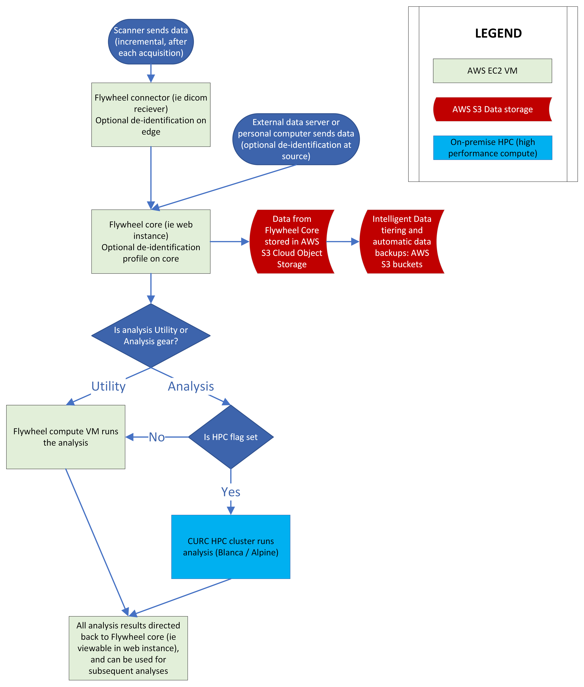
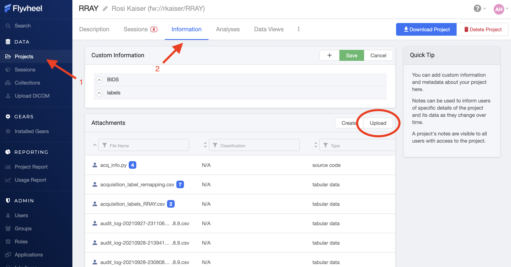
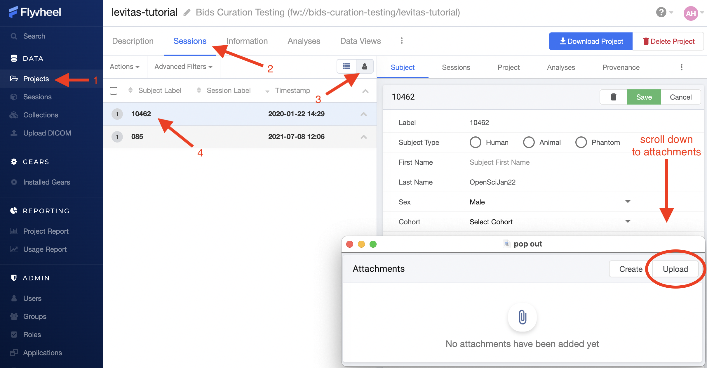
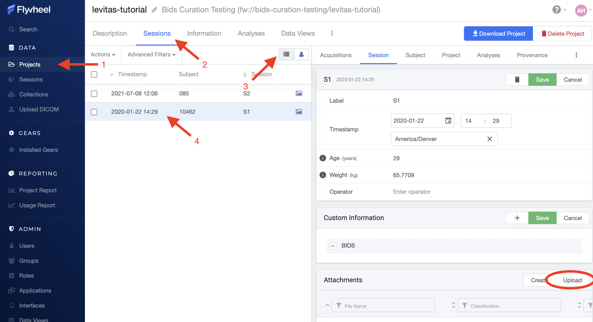
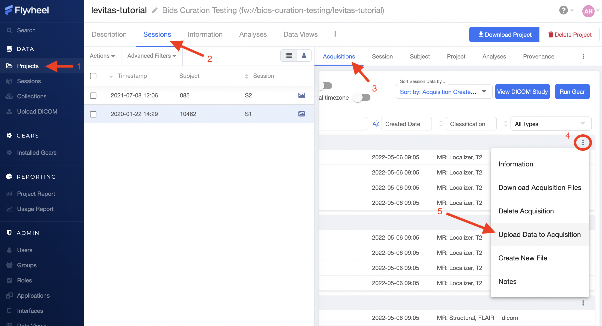

.. _hierarchy:

Hierarchy
===========
Flywheel leverages object based storage, meaning all data are represented as :code:`objects`. These objects are hierarchical, meaning they have a meaningful parent-child or "structured" relationship. A rigid "structure" is enforced for the Flywheel containers: :code:`Groups`, :code:`Projects`, :code:`Subjects`, :code:`Sessions`, :code:`Acquisitions`. All Flywheel containers has multiple attributes including metadata, file attachments, and analyses (at :code:`Project`, :code:`Subject`, :code:`Session` levels)

As discussed in more detail within :ref:`User Permissions` :code:`Projects` contain additional information regarding User access and permissions for all data stored within a given project.

.. image:: imgs/hierarchy/flywheel-data-model.png
   :alt: Basic Schematic describing flywheel architecture

Image originally generated by Penn LINC Neuroinformatics

Flywheel Connector
********************
One important function of Flywheel is its role as a 'PACS' system. The :code:`Flywheel Core` houses the main flywheel database and software. This system *accepts* imaging data from the INC Prisma Fit Scanner via the :code:`Flywheel Connector`. Imaging data, primarily dicom images, are passed from the scanner to the :code:`Flywheel Core`. For investigators using our scanning facilities, all sessions will be automatically imported into Flywheel. A set of images collected on a single day for a single participant will be organized into a :code:`Session`. An :code:`Acquisition` generally contain a set of dicom images, and any other accompanying data sent directly from the scanner.

Basic schematic of INC's deployment of Flywheel.io infrastructure. Data is sent from the scanner at INC to the :code:`Flywheel Connector` (a virtual machine running on CU Boulder's computer science network). The :code:`Flywheel Connector` then sends data to the :code:`Flywheel Core` (where data are permanently stored and which runs the "user interface"). Different types of analysis requests can then trigger jobs to be run on either AWS virtual machines, or on our on-premise HPC clusters (Blanca, and Alpine). The :code:`Flywheel Core` database is stored on AWS S3 Cloud Object Storage, where intelligent tiering is used to automatically transition infrequently used files to cost effective archive storage.

Uploading Files
*****************
Files may also be uploaded through the user interface (UI) or command line interface (CLI). We will discuss using the CLI in a later section of this documentation. For now, we will focus on the ways to upload a file from the user interface.

Files may be uploaded into containers including, :code:`Projects`, :code:`Subjects`, :code:`Sessions`, and :code:`Acquisitions`.

.. warning:: DICOMS should be uploaded using a special Flywheel feature called "Upload DICOM" and not uploaded as file attachments!

Upload Project Files
------------------------
Project files can be stored in Flywheel within the Project's Information attribute. Project files may include files such as a copy of the MR scanning protocol, study protocols, or any other document relevant to the *entire study*.

.. note:: **Remember**: Protected health information or personally identifiable information may **NOT** be stored anywhere within Flywheel, including within file attachments. Please be sure to scrub all identifying information before uploading any files.

To upload files, (1) navigate to the Projects view, (2) select the "Information" panel, (3) Select upload. From the upload menu you can either drag and drop files or point to file you wish to upload.

You may wish to check your file has been attached to the project by viewing the list of attachments.

Upload Subject Files
---------------------
Including file attachments may also be useful at the subject or session level. Both Subject containers and Session containers have unique metatdata. For example, Subject containers have key:value pairs for information such as participant Label, Sex, and Cohort (this information may be customized and will be discussed later). In addition, Subject level files may be added as attachments. Examples of these files include behavioral data not tied to a session (such as reading level), consent forms (de-identified ONLY!), and more.

To upload files, (1) navigate to the Projects view, (2) select the "Sessions" panel, (3) show all sessions grouped by subject, (4) select the subject of interest from the list. Finally, scroll down to "Attachments", and select Upload.

Upload Session Files
-----------------------
Uploading session files is a similar process used for subject files. Examples of files that may be attached at a session level would include behavioral data collected with a scanning session such as questionnaires, surveys, task responses, etc.

To upload files, (1) navigate to the Projects view, (2) select the "Sessions" panel, (3) show all sessions by list, (4) select the session of interest from the list. Finally, scroll down to "Attachments", and select Upload.

Upload Acquisition Files
-------------------------
Finally, files can be attached to an acquisition. If your study is using DICOM ingestion from the MR scanner, each acquisition already contains multiple files, such as dicom.zip and nifti formatted files. Examples of additional files that could be uploaded here would include timing files for events presented during the specific acquisition, KSpace Data, and more!

To upload files, (1) navigate to the Projects view, (2) select the "Sessions" panel, show all sessions by list, and select the session of interest from the list, (3) Select the Acquisition from within "Sessions" panel, (4) Identify the Acquisition of interest, scroll to the far right, and select the ellipsis, (5) From the drop down menu, select "Upload Data to Acquisition".

Modifying and Creating Files
*****************************
Creating files from scratch within Flywheel is conducted in a similar way to uploading files, as described in detail above. When creating files in Flywheel, a list of supported file types will be provided including "Plain Text", "JSON", "Python". Once you have entered the information you wish to store in the file, select "Save Changes" and provide a meaningful filename.

Modifying files can be accomplished in 2 ways:

    1. Upload a file with the same name as an existing file
    2. Edit the file directly with the User Interface in Flywheel (only for select filetypes)

When a file has been modified, a BLUE icon will show up next to the file name with a counter (e.g. 1,2,3). This icon indicates the *version* of that specific file. By selecting the BLUE icon, you can also see all prior versions of the same file. In a subsequent document, we will go into detail about version control and provenance in Flywheel.