.. _navigating_ui:

Navigating The User Interface
=============================
Flywheel.io's user interface is a flexible powerful platform where users can do almost anything from creating and viewing data, to running analyses, and inviting collaborators to participate. The following provides a *brief* sample of the actions that can be taken within the Flywheel user interface. Please attend INC Courses on Using Flywheel to learn more!

Logging Into Flywheel
**********************
Flywheel uses CILogon service to manage access to their platform. CILogon is used by most academic institutions around the world to manage institutional accounts and therefore makes it very easy to add users, and log in with externally managed University credentials!

University of Colorado Users
++++++++++++++++++++++++++++++
    To logon as a UCB user, you need only a University of Colorado identikey. If you're not sure if you have one, contact INC staff.

    .. warning::
       Experiencing issues logging in? **Try changing browsers**. For more info visit our :ref:`faqs` page.

1. From your web browser, go to Flywheel `flywheel.rc.colorado.edu <https://flywheel.rc.colorado.edu>`_

2. Select University Credentials via CILogon

3. If this is your first time logging on, you will be redirected to the CILogon portal to select your organization.

    - Find University of Colorado Boulder
    - Check “Remember this Selection"
    - Click “Log on”

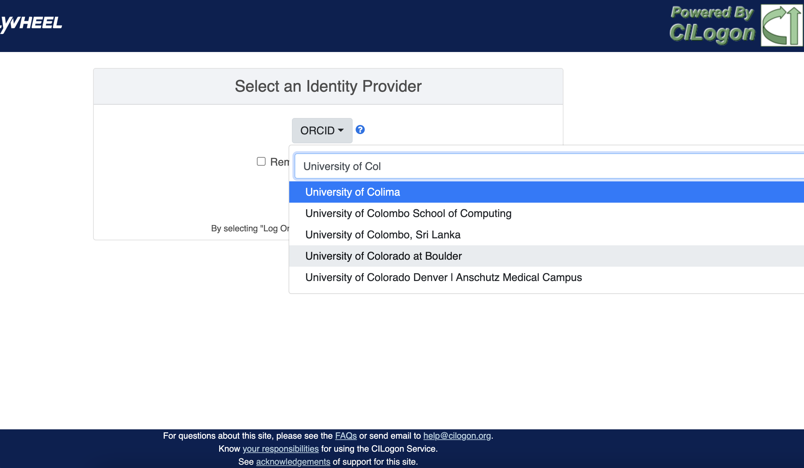

4. You will be directed to the CU Boulder logon page. Enter your identikey and password
5. You are now on the CU Boulder Flywheel Instance!

External Users
+++++++++++++++++
    Do you have an account with a University, ORCID, or another organization that uses the CILogon system? If you are not sure, you can check `here <https://cilogon.org/>`_.

    :I already have a CILogon Connected Account:

        Contact your collaborator at UCB with the appropriate credentials. Follow the instructions above to log in.

    :I do not have a CILogon Connected Account:
        Request a University of Colorado Boulder Affiliate Account through your UCB collaborator. These accounts will provide you access to the UCB systems for a period of one year, and usually can be generated within 5 business days.

The Flywheel Hierarchy
***********************
Before we get into how to navigate around the Flywheel interface, the following three sections are important building blocks to understand how Flywheel is designed. Understanding the Flywheel hierarchy, the back-end storage, and the container principle will help you navigate Flywheel and address your questions more readily.

A hierarchy is simply the system we rank or organize data according to a parent-child relationship. You might think of this as a folder on your computer that contains other folders and files. In this case the ‘parent’ folder has other ‘child’ sub-folders and files.

Flywheel uses a hierarchical data model to store data. In this way, data is automatically stored in an ordered way by principal investigator, study, subject, session, and acquisition.

Object Based Storage Principles
********************************
We are not going to get into the weeds here… What is important is that Flywheel uses object based storage to store all raw and derived neuroimaging data. Object based storage is a type of data storage. Object based storage is generally more efficient and attaches a more information about how the data was created, modified, or used within the data structure itself. What does this mean for you? Neuroimaging storage on Flywheel takes up less disk space (its cheaper!) and contains a lot more information to search or retrieve data later. Interested in `learning more <https://www.ibm.com/cloud/blog/object-vs-file-vs-block-storage>`_?

What are Containers in Flywheel?
********************************
Containers are the data storage building blocks within Flywheel. Why does this matter? If you are thinking about retrieving data, running analyses, or even reviewing data already stored, you need to think about how to retrieve this data from a container. In layman's terms, a container could be thought of as a “folder” on your computer which can contain other “folders” or containers, as well as files or metadata. If you are unfamiliar with the concept of metadata, think of it as information about that folder, such as when it was created or modified, its name, etc.

In Flywheel containers are used to store “groups”, “projects”, “subjects”, “sessions”, “acquisitions”, and “analyses”. We get into the meaning of each of these containers below, but you can think of these containers as folders in Flywheel that bundle metadata and data together.

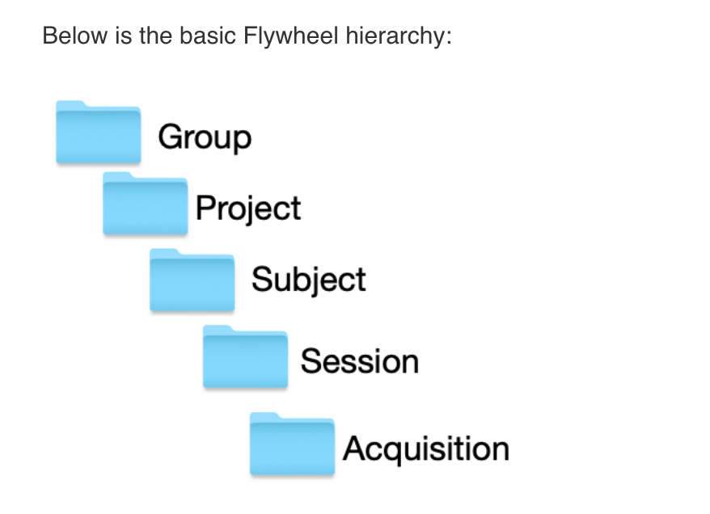

Image duplicated from docs.flywheel.io

Accessing My Groups
*********************
At INC, we use “Groups” to assign a principal investigator or laboratory. Here “Groups” can store multiple different projects or “studies”, have specific users and user permissions, and have administrative roles to add / edit / delete data and metadata for every container within. In Flywheel, you can identify Groups by the “tag” associated with any of your projects. As an Admin, you can also make changes to user permissions and projects within your “Group”. For more information on this topic, please refer to our documentation on ":ref:`User Permissions`".

Accessing My Projects
*********************
At INC, “Projects” are used to differentiate studies conducted within a Principal Investigator’s laboratory (ie, studies within a Flywheel "Group"). Users may be added to multiple projects, and once granted permission will be able to view the each project in Flywheel. All accessible projects may be viewed from the left hand ribbon on the projects page:

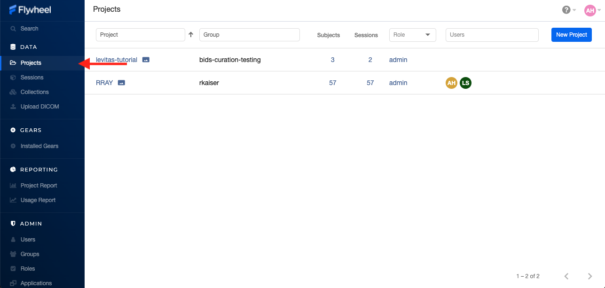

In the second column of the project list you will find the parent Group for each project. “Projects” have several attributes including a description, project files, subjects, sessions, custom data views and more! Check out our upcoming tutorials to learn more about how to customize your project to meet your needs.

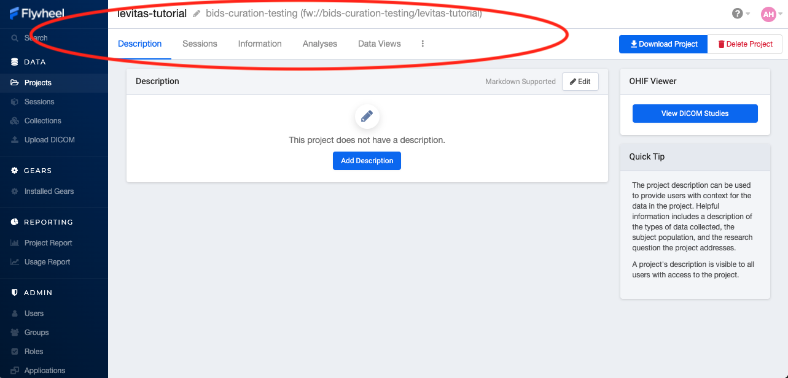

Accessing My Subjects or Sessions
*********************************
If this is a new project, you may not see any subjects or sessions linked to your project. If you have already started scanning, or have uploaded historical/retrospective data from your project you should see each scan session in “sessions.”

.. note::
    *Still can't see your data?* Remember that pesky Accession Number? Well, if the first part of that string (ie the STUDY in STUDY/SUBJECT/SESSION) wasn't entered correctly at the scanner, your data doesn't know where to land on Flywheel. Not to worry, your data will be sitting in a project called Unsorted. If you can't see this project, contact INC staff or your lab admin of Flywheel who can add you to the Unsorted Project. From there, you can move that subject to the correct Project.

“Subjects” are used to bundle sessions collected on the same participant across multiple days or “sessions”. We identify subjects using a single Subject ID. This ID should be unique to the participant in the current study. If this ID needs to be “coded” with a reference to any personal identifiable information (PII), that PII **MUST** be stored outside Flywheel in a database such as COINS or REDCap. If you have questions about storing participant information, please contact INC!

From a project within Flywheel, the easiest way to access subjects and sessions is from the “Sessions” panel shown here:

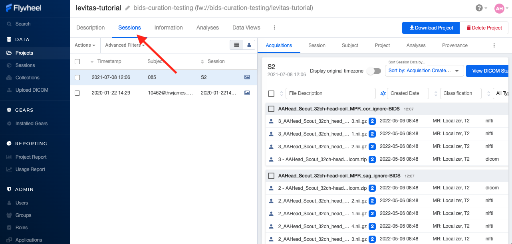

Within the sessions panel, you may notice the sessions are sorted by date of collection, and show a summary of the Subject ID and Session ID for that set of acquisitions. To view the same data in “Subject view” you need to select the Subjects’ icon shown here:

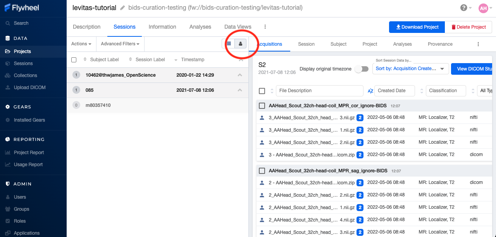

Accessing My Acquisitions and Files
***********************************
Finally, acquisitions are Flywheel containers within a session, and hold any files and metadata associated with a scanner sequence. For example, an acquisition may contain a set of dicoms, the nifti converted file for the same image, and task or behavioral data. As you may recall from earlier, these “containers” in layman's terms are just like folders or directories that hold relevant files. In Flywheel, we can see acquisitions and files within the project view, as shown below:

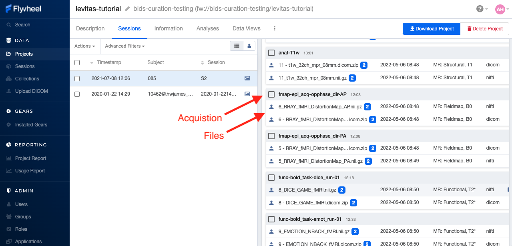

.. note::
    It's easy to confuse Acquisitions for Files because of how we use the term colloquially at the scanner. But don't be fooled, Acquisitions are not Files in Flywheel, they're still containers. In other words, an Acquisition's metadata (the information tab) will be different than the File's metadata.

Accessing My Analyses and Provenance
*************************************

Analyses are Flywheel containers that can be attached to a :code:`project`, :code:`subject`, :code:`session`, or :code:`acqusition`. For the purpose of exploring the user interface, we will focus on :code:`Session` level analyses. In the session view within Flywheel, all analyses are visible from the "Analysis" tab as shown below.

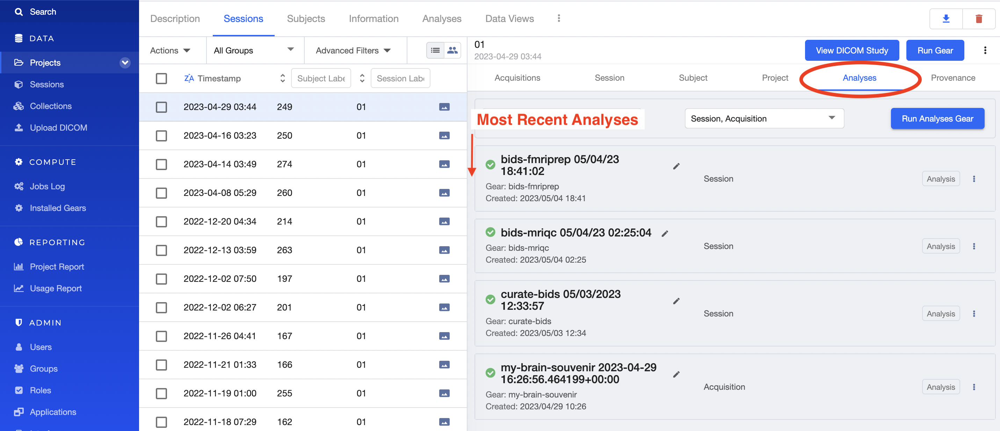

Analyses are stored in order from most recent to oldest. Analysis labels may be changed, and analyses may be deleted using the options menu at the right hand side of each analysis object.

Provenance is discussed more in the :ref:`Provenance` section. As an introduction, its good to be familiar with the provenance tab. You can review a history of all analyses run on your data in this tab, as well as view analysis logs and cancel or re-run analysis gears.

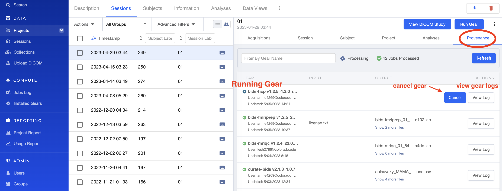

Want to learn more about how to run gears in Flywheel? Visit ":ref:`Gears`" Basics. Also check out our documentation on running commonly used gears at INC in ":ref:`Running Commonly Used Gears`"

Collections
***********
Collections in Flywheel allow users to curate data from a range of projects or based on specific criteria. For example the ‘Radiologist Review’ collection will be used at UCB to curate images requiring incidental finding reviews for a radiologist. Further, collections can have a separate set of users and permissions in order to share specific sessions with users outside your study team. This feature can be found by clicking the collections view as seen here:

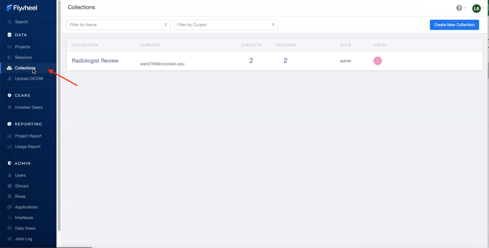

Data Views and Project Reports
*******************************
Data Views and Project Reports can be used to compile metadata from any project. Data Views provide the most flexibility to generate tabular views of any metadata within Flywheel such as age, race, sex, acquisition info, and more. These views can be shared or exported for 3rd party statistical packages.

Project Reports provide a summary of all sessions collected over a specific time range. Basic descriptive statistics are computed on all demographic information described in each session.

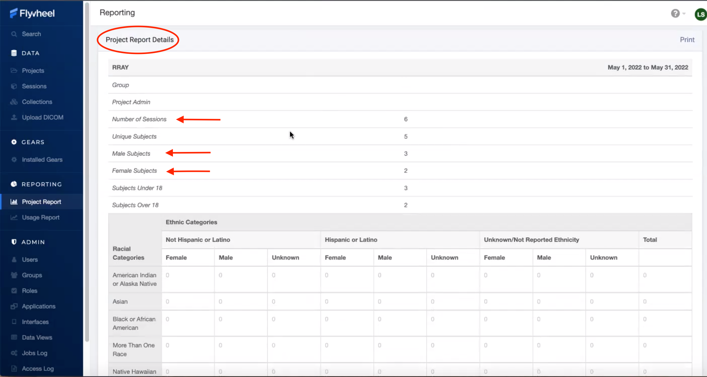

Usage Reports
*******************
Usage Reports outline overall computing metrics for each project. Basic metrics include disk usage and number of gears (or Analyses) run.

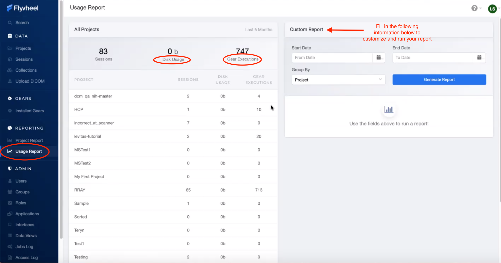

.. sectionauthor:: Amy Hegarty <amy.hegarty@colorado.edu>
