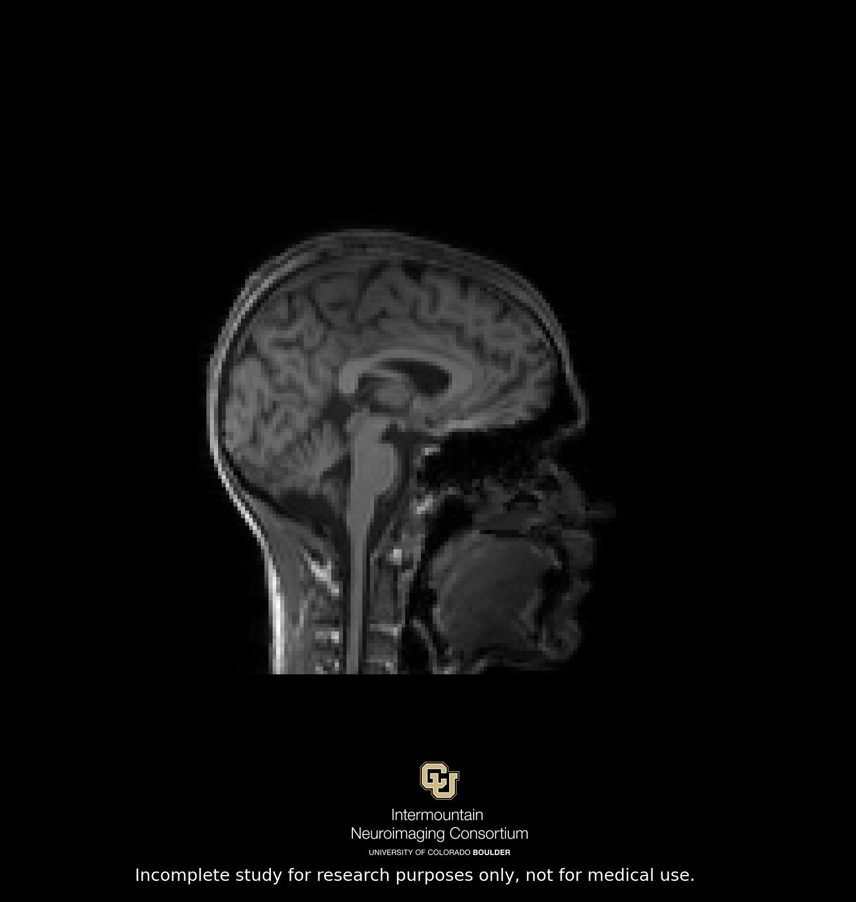

.. _new_study:

Starting A New Study?
========================

Starting a new study in Flywheel is quick and easy! The infrastructure in place streamlines study concept to final analysis results faster than ever!

INC staff will set up your project in Flywheel. Be sure to contact INC staff to set up time to test/practice your study protocol on the MRI scanner. Piloting data will be made available in the newly created Flywheel project. Here are the steps to take once your project is created:

**Step 1:** Permissions: Add all study personnel who needs access to study data within Flywheel. Check out :ref:`User Permissions` for more information.

**Step 2:** Acquisition naming - if you plan to use BIDS formatting, ensure all acquisitions comply with Reproin naming conventions.

**Step 3:** Add or enable gear rules for basic data processing (classifier, dcm2niix, brain souvenirs).

**Step 4:** Upload generic and commonly used files to the project:

    (1) .bidsignore

    .. code-block::

        *.txt
        gear*.json
        *.pdf
        *.fsf
        *.zip
        *ignore-BIDS.json

    (2) license.txt (freesurfer license file) `generate here <https://surfer.nmr.mgh.harvard.edu/fswiki/License>`_

    (3) scanner protocol (INC staff will provide)

**Step 5:** Setup completeness worksheet.

We highly recommend documenting your full protocol using completeness.csv and use the hierarchy curator in Flywheel to check each data collection session against the expected template. It helps catch errors in data collection or transfer quickly! For more information on how to create and use completeness worksheets visit our github `repo. <https://github.com/intermountainneuroimaging/flywheel_sdk_examples/tree/main/1_metadata_and_curator>`_

You can also set up a session template in Flywheel, which provides a limited check of session completeness. For more information about Flywheel's study templates visit their website `here <http://docs.flywheel.io/admin/project_config/admin_session_templates/#view-sessions-that-dont-follow-the-template>`_

Brain Souvenirs
******************
As a thank-you for participating in research, INC generates "brain souvenir" images for study participants using the `My Brain Souvenir <https://github.com/intermountainneuroimaging/my-brain-souvenir>`_ gear (see :ref:`Running Commonly Used Gears`).

Electronic Souvenirs
++++++++++++++++++++++
Electronic brain souvenirs are generated automatically for all study participants — no gear needs to be manually launched. Lab staff should access and download the souvenir from the list of session analyses for that participant's session.

.. note::
    Flywheel does not email or share the souvenir on your behalf. Communicate with the participant directly about how you'll share their electronic souvenir with them — check with your IRB coordinator about appropriate sharing methods.

3D Printed Souvenirs
++++++++++++++++++++++
Looking for something more lasting? INC also offers 3D printed brain souvenirs, which can be picked up within 2 weeks of the scan.

.. note::
    Interest in a 3D printed souvenir should be noted on the Scanner Requisition Form at the time of scheduling.

For more information about how to get started with a new Study in Flywheel, check out our video: *Starting a New Study* (coming soon).
