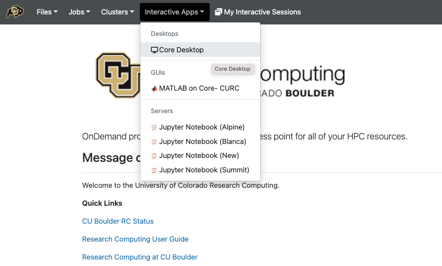
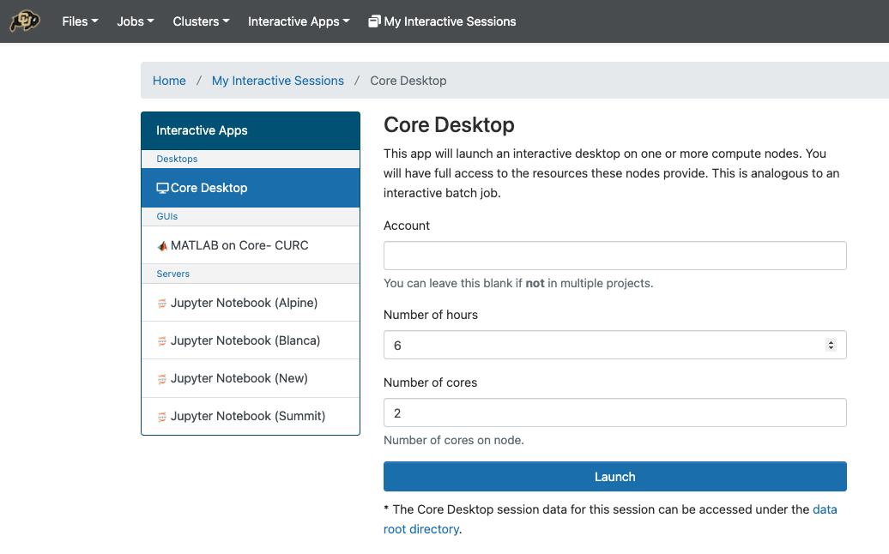
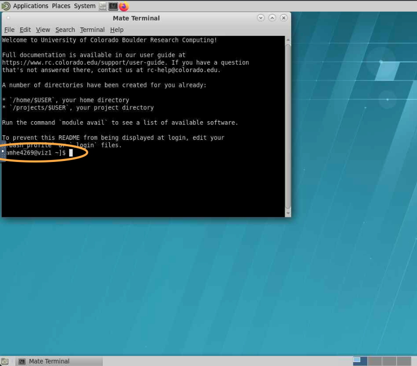
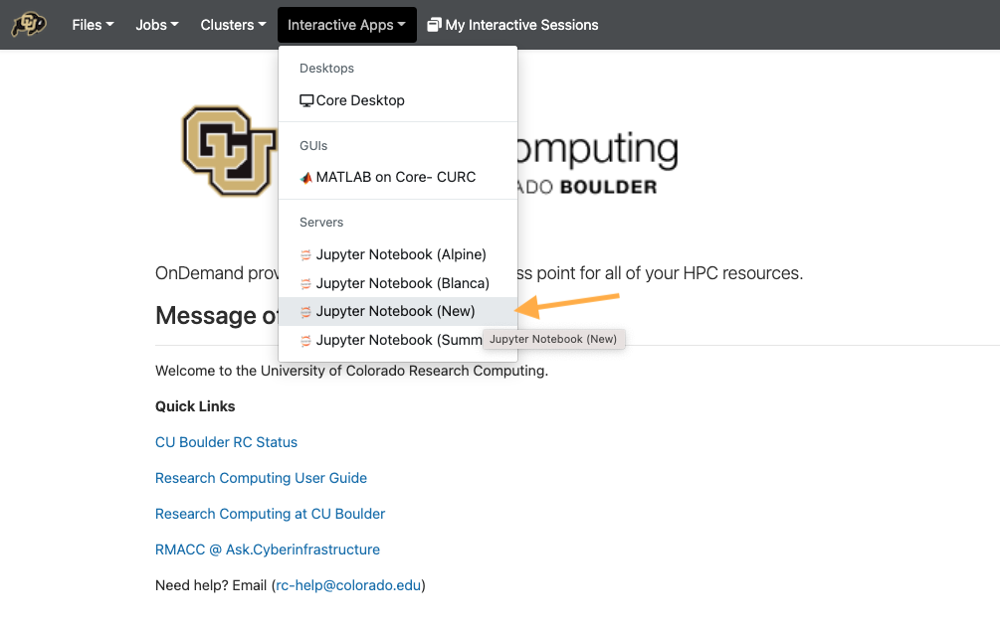
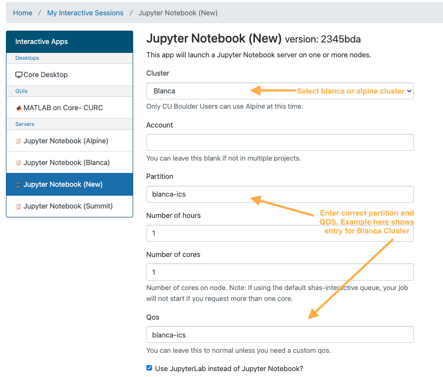

.. _petalibrary_and_blanca:

The Basics
===============

Don't have a research computing account yet? Please request an account `here <https://www.colorado.edu/rc/>`_.

More to come...

High Performance Compute Portal
================================

CU Boulder Reserach Computing (CURC) supports a browser based HPC Portal, **Open OnDemand** `here <https://curc.readthedocs.io/en/latest/gateways/OnDemand.html>`_. This browser based portal allows users to navigate and interact with CURC's HPC from any anywhere with an internet connection! Its fast and easy one stop shop for your HPC needs.

Please visit CURC documentation on `Open OnDemand <https://curc.readthedocs.io/en/latest/gateways/OnDemand.html>`_ for a step by step guide.

In the document below we will talk through the methods you need to access the HPC environment and get started with your own neuroimaging analyses. First, lets consider your "use case." How will you be using HPC? Once you have that answer in mind, let us work through the following questions.

Do you need a Desktop?
-----------------------
In your *use case* will you need to interact with a graphical user interface (GUI)? Some examples where you may need a desktop include using `CONN: Functional Connectivity Toolbox <https://web.conn-toolbox.org/>`_, viewing spreadsheets, or html reports, viewing data or images such as nifti images or surface meshes. Most other cases (such as moving/copying/deleting files, running bash or python code, etc.) can be achieved without a User Desktop.

  :If you answer "Yes":
    You will use Open OnDemand to start a new "Core Desktop" Interactive session. Follow the instructions in :ref:`Using Core Desktop` to get started.

  :If you answer "No":
    Without a desktop, we recommend you use an interactive "Jupyter Notebook" session. Follow the instructions in :ref:`Using Jupyter Notebook (New)` to get started.

Using Core Desktop
+++++++++++++++++++++
Core Desktop is used to open a "Desktop" view into the HPC. The desktop is run on CURC's **viz nodes** which are special GPU accelerated login nodes designed to support running desktop viewers for multiple users.

To get started, go to `open ondemand <https://ondemand.rc.colorado.edu>`_.

1. From the dropdown list of "Interactive Sessions", Select **Core Desktop**

2. Set the compute options for your **Core Desktop** session.

3. Launch the new Desktop. Here you can start a terminal, or another application.

.. note::
    the Desktop is running on a **viz node**. To access filesystems and compute nodes exclusive to Blanca, you must first start a secure shell (SSH) to blanca login nodes.

Scratch and Blanca Compute From Desktop
********************************************
At present, some CURC resources are not accessible directly from the viz nodes used to house Core Desktop sessions. Therefore, we must first move to either a :code:`Blanca head node` or :code:`Alpine compile node` to access scratch filesystem and run compute jobs.

The easiest way to do this is using secure shell (SSH)

.. code-block::

    # to log into Blanca head nodes
    ssh -X blogin01

    # to log into Alpine compile nodes
    module load slurm/alpine
    acompile

Finally, some filesystems and software should only be used on compute nodes (the "workhorses" of HCP). You may start an interactive session in order to access these resources using Slurm's interactive session.

.. code-block::

    # to start a blanca interactive session (from blogin01 or blogin-ics2)
    sinteractive --partition=blanca-ics --qos=blanca-ics -c <number of cores> --mem <memory 1K/1M/1G> -t <time> --export=NONE

    # to start a alpine interactive session (from an alpine compile node)
    sinteractive --partition=amilan -c <number of cores> --mem <memory 1K/1M/1G> -t <time> --export=NONE

Looking for more information on using Slurm scheduler, blanca priority accounts, and more check out <placeholder>

Using Jupyter Notebook (New)
++++++++++++++++++++++++++++++
In most cases, actions you need to take on the HPC can be done using a terminal or within python using a Jupyter Notebook or Console. Want to learn more about Jupyter Notebooks? read up `here <https://curc.readthedocs.io/en/latest/gateways/jupyterhub.html>`_.

To get started, go to `open ondemand <https://ondemand.rc.colorado.edu>`_.

1. From the dropdown list of "Interactive Sessions", Select **Jupyter Notebook (New)**

2. Set the compute options for your **Jupyter Notebook** session. Be careful to correctly set both the partition and QOS section, to match the desired cluster. Here are examples of correct partition/QOS settings:

    :Blanca Cluster:
       | Partition:  :code:`blanca-ics`
       | QOS:        :code:`blanca-ics`

    :Alpine Cluster:
       | Partition:  :code:`amilan`
       | QOS:        <leave blank>

.. note::
    The new jupyter notebook session will be launched from a :code:`Blanca` or :code:`Alpine` compute node depending on your preference.

3. You can use the **Terminal** feature to run any shell scripts, as well as the Python **Console** and Python **Jupyter Notebook** for any python based scripts.

Setting Up Conda Environments
++++++++++++++++++++++++++++++
Our data and analysis team at INC have generated several custom python environments to support the needs of our researchers. Anaconda makes it easy to build and interchange virtual environments for running your python code. If you are new to anaconda, please check out research computing documentation on the `subject <https://curc.readthedocs.io/en/latest/software/python.html>`_.

To get started using the INC anaconda environments, please do the following:

1. Create a text file :code:`~/.condarc` with the contents:

.. code-block::
    pkgs_dirs:
  - /projects/$USER/.conda_pkgs
envs_dirs:
  - /projects/$USER/software/anaconda/envs
  - /projects/ics/software/anaconda/envs

2. Check you can "see" all the shared conda environments:

.. code-block::
    [amhe4269@bnode0301 ~]$ module load anaconda
    (base) [amhe4269@bnode0301 ~]$ conda env list
    # conda environments:
    #
    base                  *  /curc/sw/anaconda3/2020.11
    atocblm_22               /curc/sw/anaconda3/2020.11/envs/atocblm_22
    globus                   /curc/sw/anaconda3/2020.11/envs/globus
    synoptic_f22             /curc/sw/anaconda3/2020.11/envs/synoptic_f22
    datalad                  /projects/ics/software/anaconda/envs/datalad
    dcm2BIDS                 /projects/ics/software/anaconda/envs/dcm2BIDS
    flywheel                 /projects/ics/software/anaconda/envs/flywheel
    incenv                   /projects/ics/software/anaconda/envs/incenv
    jupyter                  /projects/ics/software/anaconda/envs/jupyter
    nda-tools                /projects/ics/software/anaconda/envs/nda-tools
    pysurfer                 /projects/ics/software/anaconda/envs/pysurfer
    sahahn_neurotools        /projects/ics/software/anaconda/envs/sahahn_neurotools

.. note::
    The output of `conda env list` may look slightly different from what is shown above, but you should see paths that point to :code:`/projects/ics/software/anaconda/envs/`

3. Finally, you need to create a **kernel** to be able to access any of these environments in jupyterhub

.. code-block::
    [amhe4269@bnode0301 ~]$ module load anaconda
    (base) [amhe4269@bnode0301 ~]$ conda activate flywheel
    (flywheel) [amhe4269@bnode0301 ~]$ python -m ipykernel install --user --name flywheel --display-name flywheel

.. note::
    You need to create a python kernel for *every* conda environment you want to be accessible through jupyterhub. This has to be run for each new user.

That's it! You are ready to start developing!

Keep Reading to learn more about about leveraging the large :code:`Scratch` filesystem with Flywheel for local analyses. Go to :ref:`Get to Know Your Scratch Space`

