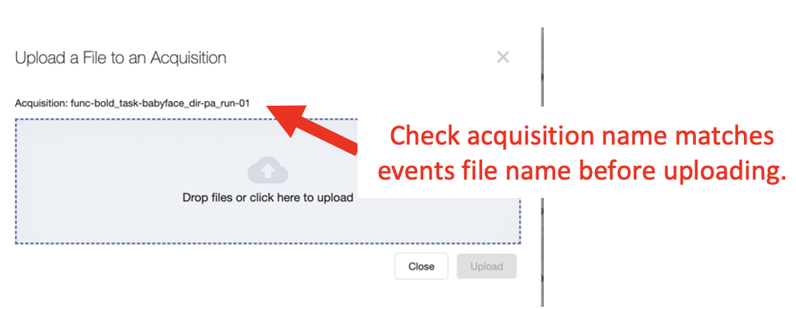

.. _upload_event_files:

Uploading Event Files
===========================

A critical step to ensure all relevant fMRI data is stored and accessible within Flywheel requires users to upload accompanying stimulus data. Users may upload the data from the user interface or from the command line. Please review both options below. **Important** Check with INC staff to confirm if stimulus log files for your project needs to follow reproin naming convention.

1. USER INTERFACE
************************
UPLOAD RAW EVENT TIMING DATA (PYSCHOPY or EPRIME)

1.	From the stimulus computer, use the experimentation software (e.g. pyschopy or eprime) to export event data in a spreadsheet format (e.g. *.csv, *.tsv).

2.	You will need to upload the event file to Flywheel, to do so: navigate to your project, and go the sessions panel. Select the session of interest.

3.	In the acquisition view, find the correct acquisition to match the event data. For example, an acquisition “func-bold_task-babyface_dir-pa_run-01”

4.	Upload the file to the Flywheel acquisition of interest.

.. image:: imgs/common_gears/event_upload_1.png
       :alt: analysis prompt

5.	Locate the file for upload. BE SURE the file is named using the correct filename convention (STEP 4). Select “Upload”.

6.	Repeat this process for all acquisitions with task related events files.

.. note:: Studies using the BIDS naming convention (BIDS Curation) should include additional curation step in the analysis workflow to add BIDS metadata objects for stimulus logs and event timing files. For an example hiearchy curator script used to apply custom BIDS metadata objects check out our github repository `here. <https://github.com/intermountainneuroimaging/flywheel_sdk_examples/tree/main/hierarchy_curator_examples>`_

2. COMMAND LINE INTERFACE
***************************
UPLOAD RAW EVENT TIMING DATA (PYSCHOPY or EPRIME)

If you are looking to upload many stimulus files together, or are intersted in scripting the upload for a crontab (automatically run for new sessions). Consider using the command line interface to upload stimulus files.

Before using the Flywheel CLI, first organize your stimulus files into the structured hierarchy enforced by Flywheel.
::
    PROJECT
    |-- SUBJECT
        |-- SESSION
            |-- ACQ LABEL 1
                |-- Stim file
            |-- ACQ LABEL 2
                |-- Stim file
            |-- ACQ LABEL 3
                |-- Stim file

For example the file tree could look like...
::
    my-directory
    |-- my-project
        |-- 001
            |-- S1
                |-- func-bold_task-motor_dir-ap_run-01
                    |-- func-bold_task-motor_dir-ap_run-01_recording-pyschopy_stim.tsv
                |-- func-bold_task-motor_dir-ap_run-02
                    |-- func-bold_task-motor_dir-ap_run-02_recording-pyschopy_stim.tsv
                |-- func-bold_task-nback_dir-ap_run-01
                    |-- func-bold_task-nback_dir-ap_run-01_recording-eprime_stim.tsv
        |-- 002
            |-- S1
                |-- func-bold_task-motor_dir-ap_run-01
                    |-- func-bold_task-motor_dir-ap_run-01_recording-pyschopy_stim.tsv
                |-- func-bold_task-motor_dir-ap_run-02
                    |-- func-bold_task-motor_dir-ap_run-02_recording-pyschopy_stim.tsv
                |-- func-bold_task-nback_dir-ap_run-01
                    |-- func-bold_task-nback_dir-ap_run-01_recording-eprime_stim.tsv

Notice in the above example, stimulus files are labeled using reproin naming convention to match naming of the fMRI acquisition. The stimulus file must include the suffix :code:`_recording-[pyschopy,eprime,other]` to indicate its a raw recording file. Multiple session files can be stored and should conform to the Flywheel hierarchy (project -> subject -> session -> acquisition). If events are non-unqiue across all participants, the stimulus files can be uploaded at a project level.

Once files are properly named and organized in the Flywheel hierarchy, use the following CLI command to upload to flywheel. **Important** Be sure to include the :code:`--skip-existing` argument to avoid overwriting previously uploaded data.
::
    fw ingest folder -g [group-id] -p [project-label] --skip-existing --symlinks --no-audit-log --yes [path-to-source-data]

For the above example...
::
    fw ingest folder -g ics -p my-project --skip-existing --symlinks --no-audit-log --yes /home/ics/my-directory/my-project/

Please consult INC Staff for assistance importing event files or other datatypes.

3. COMPLETENESS CHECKS
***************************
Many studies using automatic analysis workflows (see section :ref:`Automated Analysis Workflow`), will rely on the :code:`COMPLETENESS` metadata object to control which analysis stages can be run. Once event files have been uploaded for the data collection session, users should indicate the change in the :code:`COMPLETENESS` metadata object.

Select the check box next to :code:`Stimulus Complete`, and click "Save" to keep changes. Your data collection session should now be read for fMRI data analyses (e.g. FSL FEAT, afni-proc, etc).

.. sectionauthor:: Amy Hegarty <amy.hegarty@colorado.edu>