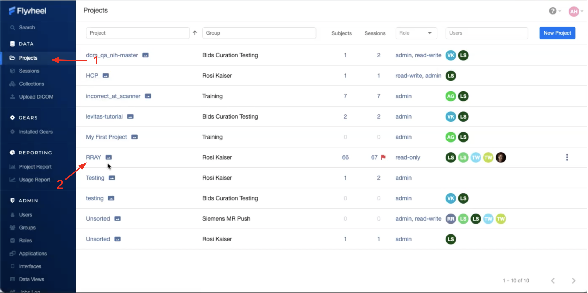
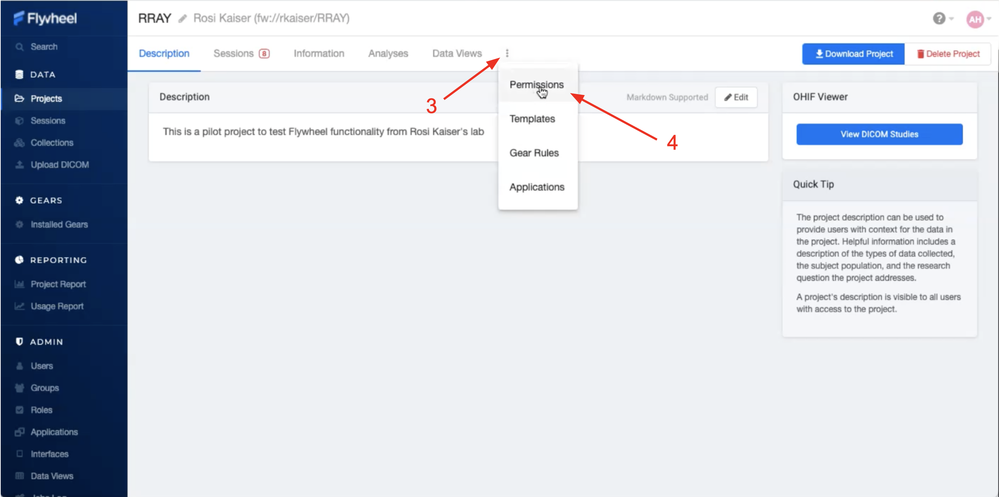
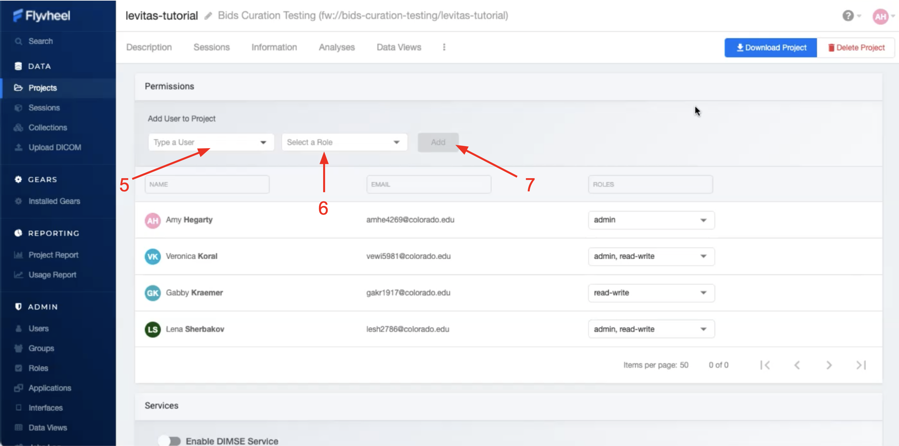
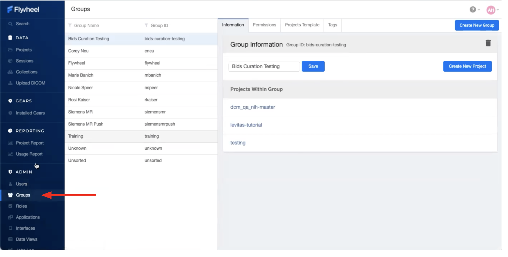
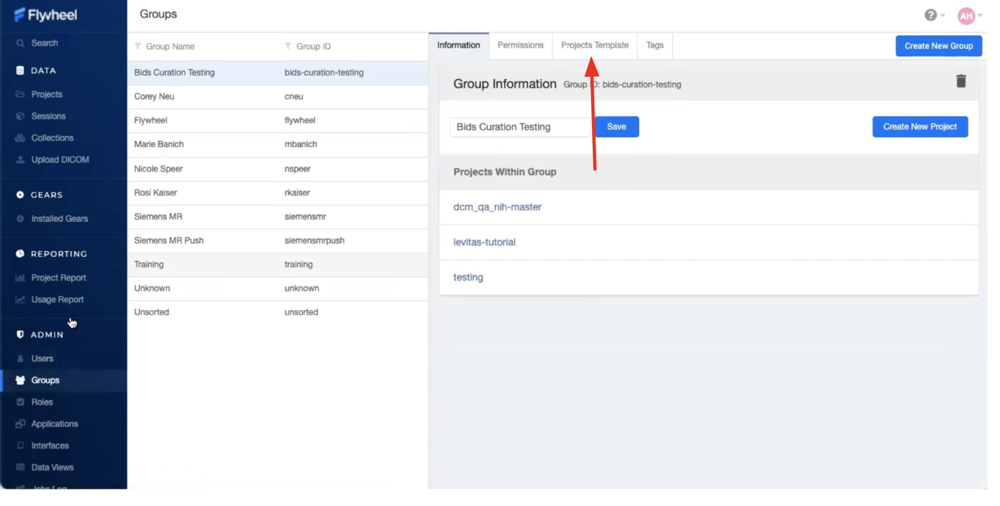
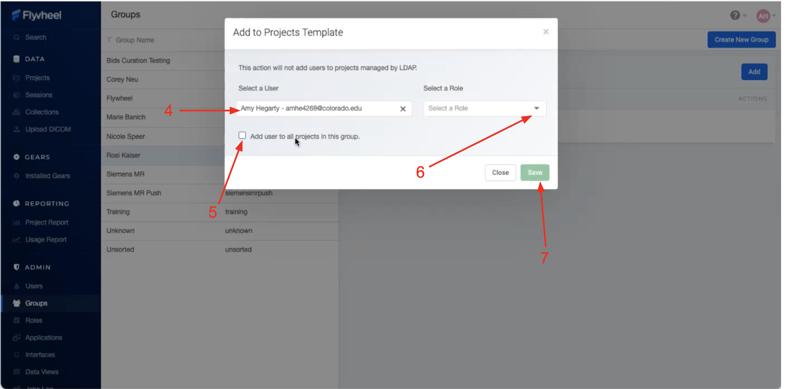
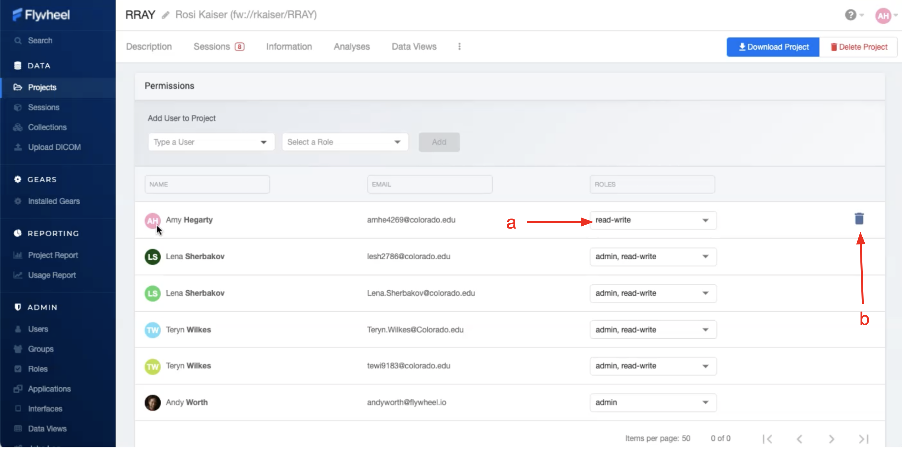

.. _user_permissions:

User Permissions
=================
Within Flywheel (flywheel.rc.colorado.edu, login with university credentials), principal investigators (you) will be assigned as an admin for your group by the INC staff, from there you will have control of adding the rest of your lab members as users. The users will already be enrolled in Flywheel by INC staff, but they not be will be assigned to any group or project. In this document, you will learn how to add users to your groups and projects, as well as how to assign them permissions, edit those permissions, and remove users if need be. The hierarchy of users in your group or project can largely be designed by you to suit your needs.

.. note::
    Haven't gotten started with flywheel yet? Check out documentation about logging in to get started :ref:`Logging Into Flywheel`.

Adding Users
**************
Users may be added to all projects belonging to a specific principal investigator, or may be added on a project by project basis. We will review how you can add users using both methods.

Adding users to projects
-------------------------
1. Navigate to "Projects" view, on the left hand ribbon

2. Select the project of interest

3. Once in the project, select the three dots along the top bar to expand all project options

4. Select "Permissions" from the dropdown menu

5. Within permissions select a user that has already been added to the UCB Flywheel instance (You may manually type a name or scroll to find the user you’re looking for)

6. You must specify the new user's role. If you have discussed any Custom roles with the INC staff you will see them here. Otherwise, you will be able to select from: "Read-only", "Read-write","admin"

    a. Multiple roles can be selected for one user by checking several of the drop down boxes next to each possible role

    b. Looking for more flexibility? Contact INC Staff to set up custom user roles for your Group.

7. Click "Add" to save the changes to your project

.. note::
    INC staff recommend adding users only to individual projects they’re working on. This improves data security, avoids confusion, and prevents access to data for any users other than those who need it.

Adding users to groups (adding them to all projects within a group)
--------------------------------------------------------------------

1. Click on the “Groups” tab under the Admin section of the sidebar menu

2. Within "Groups", navigate to “Project Templates” panel, and select "Add"

3. Select from the list of Users added to UCB Flywheel. Don't see the person you are looking for? ...Contact INC Staff.

4. To add New User to **all** existing and future projects, Check the box that says "Add user to all projects in this group"

5. Select the new user's role. Multiple roles can be selected for one user by checking several of the drop down boxes next to each possible role. Looking for more flexibility? Contact INC Staff to setup custom user roles for your Laboratory.

.. note:: INC staff recommend using this method only for a small number of users such as lab managers or other staff who will need to access all projects, other users should be added to individual projects to best practices mistakes.

Permissions
*************
Default User roles include: read-write, read-only, and admin. The read-write role allows users to view, create, modify, and delete files or analysis, but does not allow them to delete projects, modify permissions, or project settings. The read-only role allows users to view files and metadata, but prevents adding/modifying files or running analyses. The admin role allows users to essentially view, create, modify, or delete anything within the project, including users and metadata.

Who should be assigned to what role? Research assistants and students who are working with data and data analysis would fit well into the read-write role, while an external collaborator who is only looking at the data without analysis would fit best in the read-only role.

Modifying assignments
-----------------------
Initial role assignment is done when you first add a user to a group or project, as explained above. In order to change a user's assignment or remove them from a group or project follow the steps below.

    1. Follow the instructions above. Navigate to the Permissions panel within your project.
    2. From the list of added users, select the user you would like to modify permissions.
    3. From the drop down menu alter the permissions as desired.

To delete a user, (a) hover the mouse over the user of interest, (b) select the trash icon when it appears. This action will only remove the user from that project, and not from Flywheel.

Creating New Roles
--------------------
Interested in creating new roles for you Group? ...Contact INC Staff.