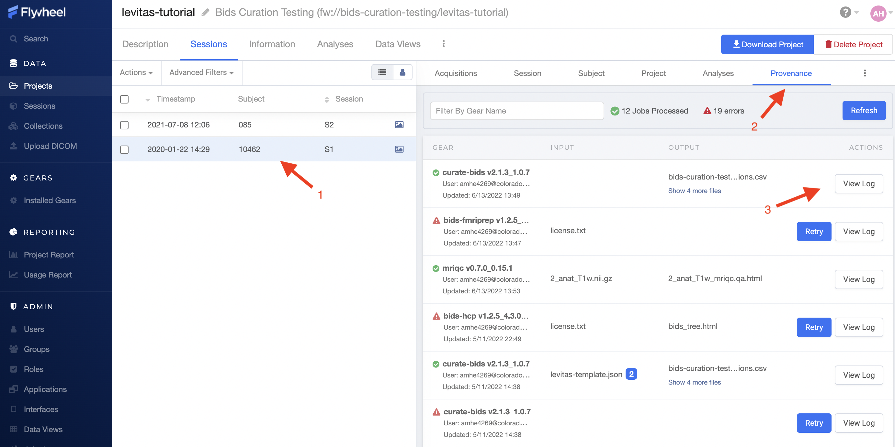
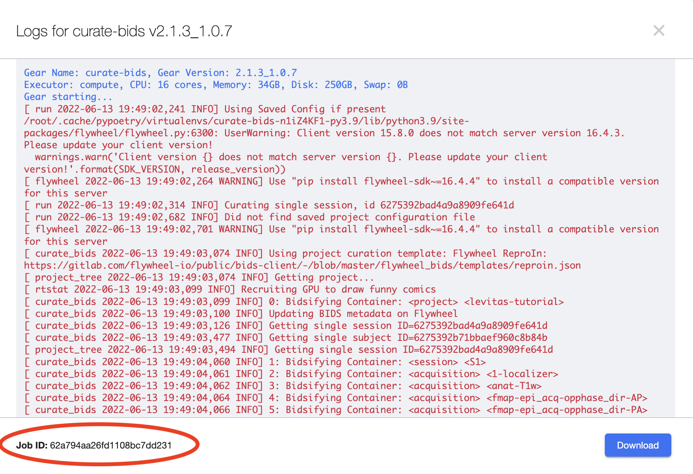

.. _version_control:

Version Control
===============
Version control is used to ensure a history of changes made to a file are retained. Within Flywheel all data are version controlled including all images (e.g. DICOMs, NIFTIs), as well as file attachments (e.g. logs, behavioral data spreadsheets). Flywheel also uses version control for gears to ensure all analyses are reproducible.

Check out Flywheel's Docs on Version Control to learn more `here <https://docs.flywheel.io/hc/en-us/articles/360061207134-File-versioning>`_!

Provenance
============
Provenance is a term we use to describe the history or source of information. For example, if I received a letter in the mail, we might think of that letter's provenance. The letter was written by someone, and placed in a specific mailbox in a specific city. That letter was then picked up by a mail carrier, went to a central processing facility, and on and on. Finally, the letter was carried by a mail carrier to my door where I opened it. Each step of the letter's journey is part of the provenance. At the letters final destination, we should be able to use the provenance to track exactly what happened to the letter at what time all the way back to when it was placed in the sender's mail box.

When we think about data provenance, this includes information about all modifications that were made to original or raw data. Each modification should be documented including what modification was taken, the analyst making the modification, the time and date of the modification, and the tools used to make the modification. This information becomes very cumbersome to maintain independently as a researcher. While our computers store some of this information, such as the time and date a file was created or modified, it falls far short of what provenance is needed to track each step that was taken on the data since inception. Luckily, Flywheel makes this very easy and stores a full provenance for all data!

Viewing Provenance
********************
Provenance can be viewed within the Flywheel User Interface. Provenance cannot be modified, or deleted within Flywheel. One important note, Flywheel does not log changes to metadata. Its critical then to ensure you are not making undesired or accidental changes to metadata fields that may not able to be recovered.

To view provenance:

    1. Select the session you want to view provenance record from Sessions List
    2. Navigate to the "Provenance" Tab
    3. You will see a list of all jobs using or modifying this session's data. Each job is labeled with an analysis name, version number, the analyst name, and job status (complete, in progress, failed). To see more information about what modifications were made to the data, select "View Log"

.. _viewing_jobid:

Viewing Job Details
++++++++++++++++++++

Each analysis that was run is also assigned a "Job ID". This is a unique ID within the UCB Flywheel instance that can be used to identify the job across the platform.

To view the Job ID, open an analysis log and look for the Job ID in the bottom left corner of the logs page.

.. Note::
    To view the Jib ID, start from the provenance tab to look at the logs.

