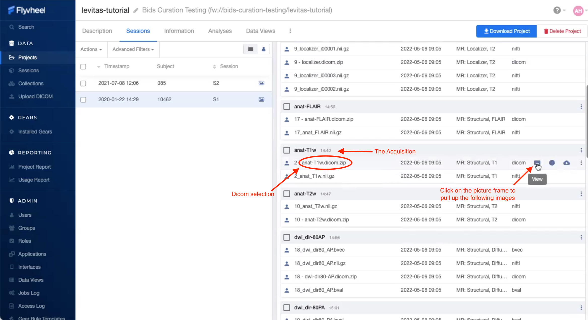
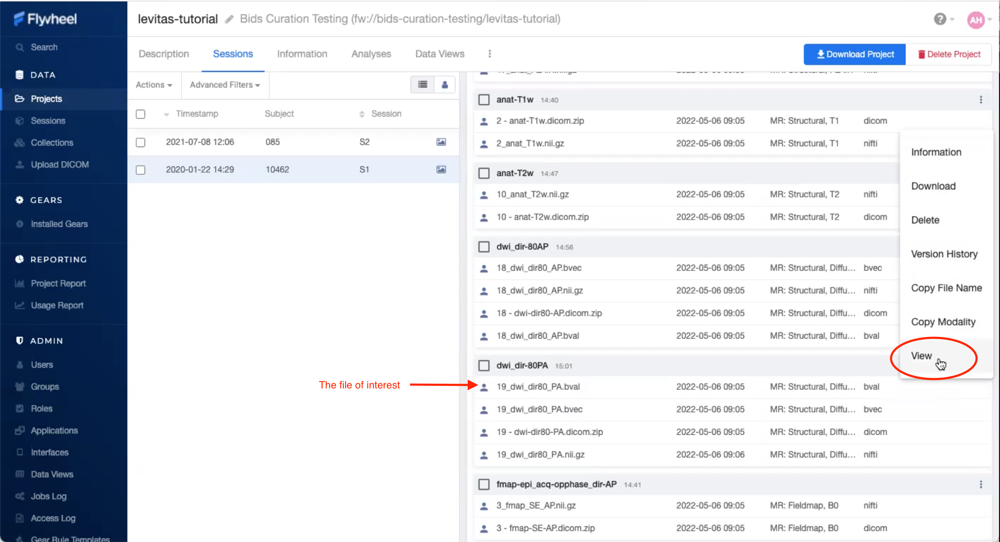
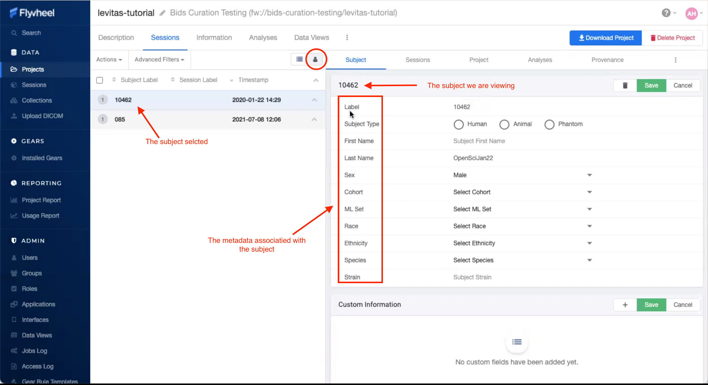
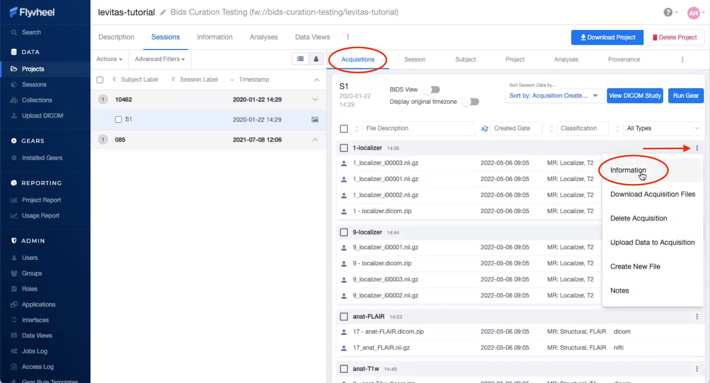
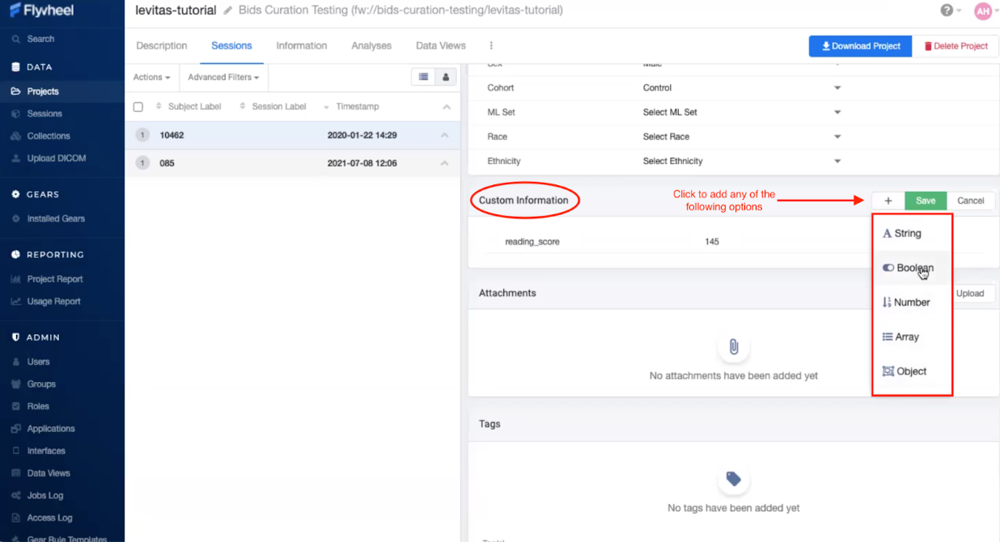

.. _viewing_data:

Viewing Data
=============
Flywheel has a range of tools that can be used to view the data within the User Interface. These applications are being regularly updated and improved by the Flywheel Support Team. Please understand with the rapid development of viewers and applications in Flywheel some of the documentation contained below and on the Flywheel docs may be out of date. If you have any questions about current features for viewing data, contact INC Staff.

Viewing DICOMS
****************
Flywheel has an integrated DICOM viewer which allows you to view, interact, and edit DICOMS directly within our instance. Please visit Flywheel Docs for instructions on how to use the viewer `here <https://docs.flywheel.io/hc/en-us/articles/360052083993-View-and-annotate-images>`_.

Using the "Picture" icon located next to subject, session, or file will automatically launch the dicom viewer and load the active dicom images.

Viewing NIFTIs
****************
The same viewer can be used to view  NIFTI formatted files. Just as above, navigate to the image of interest, then select the "Picture" icon to open the viewer. Want to learn more? Visit the Flywheel `docs <https://docs.flywheel.io/hc/en-us/articles/360052083993-View-and-annotate-images>`_.

Viewing Other File Formats
****************************

Viewing plain text files
---------------------------
Text files can be viewed and edited within Flywheel's User Interface. To view or edit text files:

    1. Navigate to the file of interest
    2. Click the vertical ellipsis to expand the options menu for the file
    3. Select View

In the viewer you can make changes to the text and save, or simply view the contents of the file.

.. note::
   Remember, Flywheel is organized with a rigid :ref:`Hierarchy`. All data is managed by membership to a specific "level" in Flywheel.

.. code-block::

    Group --> Project --> Subject --> Sessions --> Acquisitions
         files --^-----------^------------^-------------^-- files

Viewing spreadsheets
-------------------------
Spreadsheets may also be viewed within Flywheel. At this time, spreadsheets cannot be modified in the interface. Instead, if changes are needed, a new version of the spreadsheet must be uploaded to the Flywheel instance.

Adding and Modifying Metadata
*******************************

Metadata is simply information about your data or "data about data". Metadata does not include the contents of your data such as the image itself. Instead, metadata is generally descriptive information about the data such as when the file was created or modified, the file owner, etc. Flywheel metatdata is stored at each level of the Flywheel hierarchy, with descriptive information about the :code:`Project`, :code:`Subject`, :code:`Session`, :code:`Acquisition`, :code:`Analysis`, or :code:`File`.

For example, each subject has rich metadata associated with that "container".

Acquisition and file metadata can be viewed in Flywheel by first expanding the menu options, and selecting Information.

Adding Custom Metadata
-----------------------
It is also possible to add your own metadata within the “Custom Information” section. Users may add different “types” of metadata such as strings, lists, boolean values, numbers, and complex objects containing additional metadata. For more information about adding your own metadata visit the flywheel documentation (`here <https://docs.flywheel.io/hc/en-us/articles/360015412973-Add-and-edit-custom-metadata#:~:text=Subject%20and%20session%20custom%20metadata,click%20%2B%20next%20to%20Custom%20Information.>`_).

